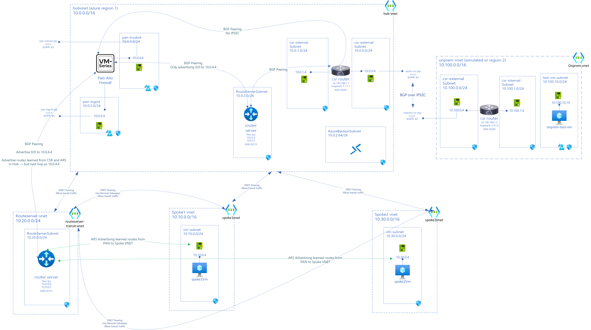

# Azure Hybrid Networking Routing Lab - Hub and Spoke Architecture with Azure Route Server, Palo Alto Firewall (PAN) and Cisco CSR Router (CSR)

## Introduction

This lab demonstrates Routing of traffic in Hub and Spoke architecture with Azure Route Server, Palo Alto VM Series Firewall (PAN), and Cisco CSR Router(CSR))

> *This lab is for testing/learning purposes only and should not be considered production configurations*

### Objective

- Get deeper understanding of BGP, AS-Path, Routes, Default Routes in Azure, Effects of VNET peering, IPSec Tunnel
- Learn on configuring PAN and CSR NVAs in Azure
- Understand how route injection with BGP Peering of NVAs and Azure Route Server
- Learn dynamic route injection in Spokes using Azure Route Server
- Route North-South traffic via PaloAlto VM Series Firewall (PAN)
- Route East-West traffic to on-prem via PAN
- Route Spoke to Spoke traffic via PAN

### Lab Architecture

### Lab Series

This lab is divided into series and each lab builds on previous lab.

> *This lab is for testing/learning purposes only and should not be considered production configurations*

- [Lab 1](lab1/README.md)
  - Deploy CSRs in Azure Hub Network and On-prem (simulated in Azure).
  - Connect CSRs via IPSec and configure BGP
  - Test connectivity between CSRs and show routes
  - Setup Test VM on-prem to validate connectivity
- [Lab 2](lab2/README.md)
  - Setup Azure Route Server (ARS) in Hub and BGP Peer with Azure CSR
  - Understand BGP Peering between ARS and CSR and effects of route injection in spoke VNET via Azure Route Server
  - Deploy Spoke Network and test VM in spoke
  - Test connectivity between Spoke VM and On-prem VM
  - 0/0 route directly to Internet (no traffic inspection)
- [Lab 3](lab3/README.md)
  - Setup Palo Alto VM Series Firewall (PAN) in hub and BGP Peer with ARS only
  - No BGP Peering between PAN and CSR
  - Advertise 0/0 via Firewall route to ARS for North-South Traffic Inspection
  - Test Connectivity between Spoke VMs and On-prem VM
  - Validate internet traffic (north-south) inspected via PAN Firewall
  - Validate spoke to spoke inspected via PAN FW
  - Validate traffic to On-prem bypasses PAN FW and directly goes via CSR
- [Lab 4](lab4/README.md)
  - BGP Peer PAN to CSR so PaloAlto Virtual Router can learn BGP routes from CSR in Hub
  - Configure PAN BGP peer
  - Potential approach to fix broken routing due to peering of PAN and CSR
- Lab 5
  - Deploy Route Server in Transit VNET to propagate routes to Spoke VNETs
  - Spoke VNETs to use ARS in Transit instead of Hub
  - Test Connectivity between Spoke VM and On-prem VM
  - Validate internet and on-prem traffic inspected via PAN Firewall
  - Spoke Traffic to On-prem via PAN Firewall
  - Spoke to Spoke traffic via PAN Firewall
  - Spoke to Internet traffic via PAN Firewall

#### References (coming soon)
