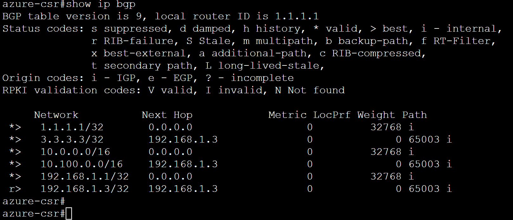
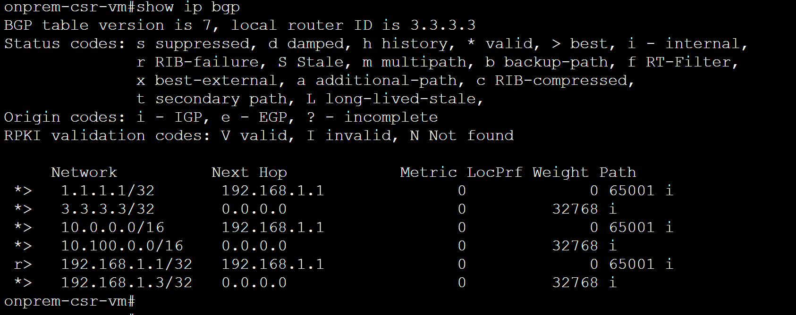

# Azure Hybrid Networking Routing Lab Series

## Lab 1 - Deploying Hub VNET in Azure and Simulated On-Prem then setting up Cisco CSR Routers with BGP over IPSEC

### Introduction

This lab deploys 2 CSR Routers one in Azure Hub VNET and one in On-premise (Azure simulated) and IPSec VPN tunnel is established between CSR routers. BGP is established between CSRs. An on-prem test VM is setup to ping CSR on Azure.
> *This lab is for testing/learning purposes only and should not be considered production configurations*

### Networking Architecture


### Components in this lab

- Azure Hub Environment
  - hub-vnet(10.0.0.0/16)
  - csr-internal (10.0.1.0/24) and csr-external(10.0.0.0/24) subnets in hub-vnet  
  - azure-csr Cisco CSR (tunnel ip 192.168.1.1) with public ip (azure-csr-pip) and private ips: external interface (10.0.0.4 from csr-external subnet) and internal interface (10.0.1.4 from csr-internal)
  - azure-static-rt UDR on csr-internal and csr-external with only route pointing 0/0 to Internet

- On-premise Environment (simulated on Azure)
  - on-prem vnet (10.100.0.0/16)
  - csr-internal (10.100.1.0/24) and csr-external(10.100.0.0/24) subnets in on-prem vnet
  - onprem-csr Cisco CSR (tunnel ip 192.168.1.3) with public ip (onprem-csr-pip) and private ips: external interface (10.100.0.4 from csr-external subnet) and internal interface (10.100.1.4 from csr-internal)
  - test-vm-subnet (10.100.10.0/24) with onprem-test-vm (10.100.10.10)
  - onprem-static-rt UDR on csr-internal and csr-external with only route pointing 0/0 to Internet
  - onprem-vm-rt UDR on test-vm-subnet

- Connectivity
  - IPSec (IKEV2) VPN tunnel between azure-csr and onprem-csr
  - BGP over IPSec between azure-csr and onprem-csr

### Deployment Steps

You can use either cloud shell or Azure CLI. While Azure Bastion can be used to access VMs, in this lab Serial Console is used for simplicity.

Create Resource Groups

```bash
locazure="eastus"
rgazure="azure-rg-lab"

loconprem="westus2"
rgonprem="onprem-rg-lab"

az group create -n $rgazure -l $locazure -o none
az group create -n $rgonprem -l $loconprem -o none
```

You may have to accept Cisco CSR Agreement

```azurecli
az vm image terms accept --urn cisco:cisco-csr-1000v:16_12_5-byol:latest
```

#### On-Prem environment (simulated on another Azure region)

Create On-prem Simulated environment VNET and Subnets

```azurecli
#Create On-prem VNET and Subnets
az network vnet create --name onprem-vnet --resource-group $rgonprem --address-prefix 10.100.0.0/16 -o none

#Create NSGs for on-prem CSR
az network vnet subnet create -g $rgonprem --vnet-name onprem-vnet -n csr-internal --address-prefix 10.100.1.0/24 -o none
az network vnet subnet create -g $rgonprem --vnet-name onprem-vnet -n csr-external --address-prefix 10.100.0.0/24 -o none
az network vnet subnet create -g $rgonprem --vnet-name onprem-vnet -n test-vm-subnet --address-prefix 10.100.10.0/24 -o none

```

Create On-prem CSR with public and private NICs, NSGs(allow ipsec UDP Ports and 10/8 traffic inbound)

`Change you password before creating VM`

```azurecli
# Create NSGs for on-prem CSR
az network nsg create -g $rgonprem -l $loconprem -n onprem-csr-nsg -o none
az network nsg rule create -g $rgonprem --nsg-name onprem-csr-nsg --name csr-ipsec1 --access Allow --protocol Udp --direction Inbound --priority 100 --source-address-prefix "*" --source-port-range "*" --destination-address-prefix "*" --destination-port-range 500 -o none
az network nsg rule create -g $rgonprem --nsg-name onprem-csr-nsg --name csr-ipsec2 --access Allow --protocol Udp --direction Inbound --priority 110 --source-address-prefix "*" --source-port-range "*" --destination-address-prefix "*" --destination-port-range 4500 -o none
az network nsg rule create -g $rgonprem --nsg-name onprem-csr-nsg --name allow-10slash --access Allow --protocol "*" --direction Inbound --priority 130 --source-address-prefix 10.0.0.0/8 --source-port-range "*" --destination-address-prefix "*" --destination-port-range "*" -o none
az network nsg rule create -g $rgonprem --nsg-name onprem-csr-nsg --name allow-192slash --access Allow --protocol "*" --direction Inbound --priority 140 --source-address-prefix 192.168.0.0/16 --source-port-range "*" --destination-address-prefix "*" --destination-port-range "*" -o none
az network nsg rule create -g $rgonprem --nsg-name onprem-csr-nsg --name allow-Outbound --access Allow --protocol "*" --direction Outbound --priority 120 --source-address-prefix "*" --source-port-range "*" --destination-address-prefix "*" --destination-port-range "*" -o none

az network vnet subnet update -g $rgonprem -n csr-external --vnet-name onprem-vnet --network-security-group "onprem-csr-nsg" -o none
az network vnet subnet update -g $rgonprem -n csr-internal --vnet-name onprem-vnet --network-security-group "onprem-csr-nsg" -o none

# Create on-prem CSR public and private NIC
az network public-ip create -g $rgonprem --name onprem-csr-pip --idle-timeout 30 --allocation-method Static --sku standard -o none
az network nic create -g $rgonprem --name csr-ext-nic --subnet csr-external --vnet onprem-vnet --public-ip-address onprem-csr-pip --private-ip-address 10.100.0.4 --ip-forwarding true --network-security-group onprem-csr-nsg -o none
az network nic create -g $rgonprem --name csr-int-nic --subnet csr-internal --vnet onprem-vnet --ip-forwarding true --private-ip-address 10.100.1.4 --network-security-group onprem-csr-nsg -o none

#Create CSR VM
az vm create \
 -g $rgonprem \
 -l $loconprem \
 --name onprem-csr-vm \
 --size Standard_D2S_v3 \
 --nics csr-ext-nic csr-int-nic  \
 --image cisco:cisco-csr-1000v:16_12_5-byol:latest  \
 --authentication-type password \
 --admin-username azureuser \
 --admin-password "put your \ password here" \
 -o none \
 --only-show-errors
```

Create on-prem Test VM with NSG, NIC

```azurecli
#create NSG for on-prem CSR subnet for NICs
az network nsg create -g $rgonprem -l $loconprem --name onprem-vm-nsg -o none
az network nsg rule create -g $rgonprem --nsg-name onprem-vm-nsg --name allow-10slash --access Allow --protocol "*" --direction Inbound --priority 130 --source-address-prefix 10.0.0.0/8 --source-port-range "*" --destination-address-prefix "*" --destination-port-range "*" -o none
az network nsg rule create --resource-group $rgonprem --nsg-name onprem-vm-nsg --name allow-out --access Allow --protocol "*" --direction Outbound --priority 140 --source-address-prefix "*" --source-port-range "*" --destination-address-prefix "*" --destination-port-range "*" -o none

az network nic create -g $rgonprem -l $loconprem -n testvm-nic --subnet test-vm-subnet --private-ip-address 10.100.10.10 --vnet-name onprem-vnet --network-security-group onprem-vm-nsg --ip-forwarding true -o none

az network vnet subnet update -g $rgonprem -n test-vm-subnet --vnet-name onprem-vnet --network-security-group "onprem-vm-nsg" -o none

#create test vm
az vm create --name onprem-test-vm \
 -g $rgonprem \
 -l $loconprem \
 --image ubuntults \
 --size Standard_D2S_v3 \
 --admin-username azureuser \
 --authentication-type password \
 --admin-password "put your \ password here" \
 --nics testvm-nic \
 -o none \
 --only-show-errors
```

#### Azure Hub Environment

Create Azure Hub environment VNET and Subnets

```azurecli
#Create HUB VNET 
az network vnet create --name hubvnet --resource-group $rgazure --address-prefix 10.0.0.0/16 -o none

#Create CSR External and Internal CSR Subnet
az network vnet subnet create --address-prefix 10.0.1.0/24 --name csr-internal --resource-group $rgazure --vnet-name hubvnet  -o none
az network vnet subnet create --address-prefix 10.0.0.0/24 --name csr-external --resource-group $rgazure --vnet-name hubvnet -o none
```

Create Azure CSR with public and private NICs, NSGs(allow ipsec UDP Ports and 10/8 traffic inbound)

```azurecli
#Create NSG for CSR in Hub
az network nsg create --resource-group $rgazure --name azure-csr-nsg --location $locazure -o none
az network nsg rule create --resource-group $rgazure --nsg-name azure-csr-nsg --name csr-ipsec1 --access Allow --protocol Udp --direction Inbound --priority 100 --source-address-prefix "*" --source-port-range "*" --destination-address-prefix "*" --destination-port-range 500 -o none
az network nsg rule create --resource-group $rgazure --nsg-name azure-csr-nsg --name csr-ipsec2 --access Allow --protocol Udp --direction Inbound --priority 110 --source-address-prefix "*" --source-port-range "*" --destination-address-prefix "*" --destination-port-range 4500 -o none
az network nsg rule create --resource-group $rgazure --nsg-name azure-csr-nsg --name allow-10slash --access Allow --protocol "*" --direction Inbound --priority 130 --source-address-prefix 10.0.0.0/8 --source-port-range "*" --destination-address-prefix "*" --destination-port-range "*" -o none
az network nsg rule create --resource-group $rgazure --nsg-name azure-csr-nsg --name allow-192slash --access Allow --protocol "*" --direction Inbound --priority 140 --source-address-prefix 192.168.0.0/16 --source-port-range "*" --destination-address-prefix "*" --destination-port-range "*" -o none
az network nsg rule create --resource-group $rgazure --nsg-name azure-csr-nsg --name allow-out --access Allow --protocol "*" --direction Outbound --priority 140 --source-address-prefix "*" --source-port-range "*" --destination-address-prefix "*" --destination-port-range "*" -o none

az network vnet subnet update -g $rgazure -n csr-external --vnet-name hubvnet --network-security-group "azure-csr-nsg" -o none
az network vnet subnet update -g $rgazure -n csr-internal --vnet-name hubvnet --network-security-group "azure-csr-nsg" -o none

#create NICs for Azure CSR
az network public-ip create --name azure-csr-pip --resource-group $rgazure --idle-timeout 30 --allocation-method Static --sku standard -o none
az network nic create --name csr-ext-nic -g $rgazure --subnet csr-external --vnet hubvnet --public-ip-address azure-csr-pip --private-ip-address 10.0.0.4 --ip-forwarding true --network-security-group azure-csr-nsg -o none
az network nic create --name csr-int-nic -g $rgazure --subnet csr-internal --vnet hubvnet --ip-forwarding true --private-ip-address 10.0.1.4 --network-security-group azure-csr-nsg -o none

#Create Azure CSR VM
az vm create \
 --resource-group $rgazure \
 --location $locazure \
 --name azure-csr \
 --size Standard_D2S_v3 \
 --nics csr-ext-nic csr-int-nic  \
 --image cisco:cisco-csr-1000v:16_12_5-byol:latest \
 --admin-username azureuser \
 --admin-password "put your \ passsword" \
 -o none \
 --only-show-errors
```

#### Add UDR to CSR interfaces (0/0 to Internet) to  Azure and On-prem CSRs to avoid routing loop

```azurecli
#Add UDR to CSR interfaces  (0/0 to Internet) for On-orem CSR
az network route-table create --name onprem-static-rt --resource-group $rgonprem -o none
az network route-table route create --name route-to-internet --resource-group $rgonprem --route-table-name onprem-static-rt --address-prefix "0.0.0.0/0" --next-hop-type Internet -o none
az network vnet subnet update --name csr-external --vnet-name onprem-vnet --resource-group $rgonprem --route-table onprem-static-rt -o none
az network vnet subnet update --name csr-internal --vnet-name onprem-vnet --resource-group $rgonprem --route-table onprem-static-rt -o none

#Add UDR to CSR interfaces  (0/0 to Internet) for Azure CSR
az network route-table create --name azure-static-rt --resource-group $rgazure -o none
az network route-table route create --name route-to-internet --resource-group $rgazure --route-table-name azure-static-rt --address-prefix "0.0.0.0/0" --next-hop-type Internet -o none
az network vnet subnet update --name csr-external --vnet-name hubvnet --resource-group $rgazure --route-table azure-static-rt -o none
az network vnet subnet update --name csr-internal --vnet-name hubvnet --resource-group $rgazure --route-table azure-static-rt -o none
```

#### Get public IPs for Azure CSR and On-Prem CSR

```azurecli
az network public-ip show -g $rgazure -n azure-csr-pip --query "{address: ipAddress}"
az network public-ip show -g $rgonprem -n onprem-csr-pip --query "{address: ipAddress}"
```

Note the IP Address for azure-csr-pip and onprem-csr-pip which are required to create IPSec tunnel between CSRs.

#### Enable Serial Console

You can also use Azure Bastion to SSH into CSRs. For this lab we will use Serial Console.

> Go to Portal -> Navigate to VM -> Help -> Serial Console. Configure boot diagnostics to enable Serial Console.

### Configure Azure CSR for IPSec and BGP

- Go to Serial Console -> login using azureuser and password you specified.
- Once logged in you should see `azure-csr>`
- To enter Enable Mode type 'en' at `azure-csr>en`
- You should see `azure-csr#`
- Enter Configuration mode by typing `conf t`

It will show you following:

```bash
azure-csr#conf t
Enter configuration commands, one per line.  End with CNTL/Z.
azure-csr(config)#
```

Paste in below configuration, one block at a time in config mode i.e `azure-csr(config)#`

Setup NAT for interfaces for CSR. Note: `gi1 is short for GigabitEthernet1 (10.0.0.4/24). gi2 is GigabitEthernet2 (10.0.1.4/24)`

```bash

int gi1
no ip nat outside
exit

int gi2
no ip nat inside
exit

```

Setting up Crypto for ipsec tunnel

```bash
crypto ikev2 proposal to-onprem-csr-proposal
  encryption aes-cbc-256
  integrity sha1
  group 2
  exit

crypto ikev2 policy to-onprem-csr-policy
  proposal to-onprem-csr-proposal
  match address local 10.0.0.4
  exit

```

Get public IP of on-prem CSR i.e. onprem-csr-pip before pasting this block insert your IP address into the block.

```bash
crypto ikev2 keyring to-onprem-csr-keyring
  peer "Insert onprem-csr-pip"
    address "Insert onprem-csr-pip"
    pre-shared-key Msft123Msft123
    exit
  exit
```

Example of above block will be following where you will put on-prem-csr-pip

```bash
crypto ikev2 keyring to-onprem-csr-keyring
  peer 1.2.3.4
    address 1.2.3.4
    pre-shared-key Msft123Msft123
    exit
  exit
```

Setting now IPSec Profile with remote peer

```bash
  crypto ikev2 profile to-onprem-csr-profile
   match address local 10.0.0.4
    match identity remote address 10.100.0.4
    authentication remote pre-share
    authentication local  pre-share
    lifetime 3600
    dpd 10 5 on-demand
    keyring local to-onprem-csr-keyring
  exit
```

```bash
crypto ipsec transform-set to-onprem-csr-TransformSet esp-gcm 256 
  mode tunnel
  exit

crypto ipsec profile to-onprem-csr-IPsecProfile
  set transform-set to-onprem-csr-TransformSet
  set ikev2-profile to-onprem-csr-profile
  set security-association lifetime seconds 3600
  exit
```

Setting up `Tunnel with IP Address 192.168.1.1 with source of 10.0.0.4` - Replace destination with public IP of On-prem CSR.

```bash
int tunnel 11
  ip address 192.168.1.1 255.255.255.255
  tunnel mode ipsec ipv4
  ip tcp adjust-mss 1350
  tunnel source 10.0.0.4
  tunnel destination "onprem-csr-pip"
  tunnel protection ipsec profile to-onprem-csr-IPsecProfile
  exit 

```

Setting up Loopback for testing

```bash
!loopback interface only for testing
int lo1
ip address 1.1.1.1 255.255.255.255
exit
```

Setting BGP with on-prem CSR and route BGP IP over tunnel

```bash

router bgp 65001
  bgp log-neighbor-changes
  neighbor 192.168.1.3 remote-as 65003
  neighbor 192.168.1.3 ebgp-multihop 255
  neighbor 192.168.1.3 update-source tunnel 11
  address-family ipv4
    network 10.0.0.0 mask 255.255.0.0
    network 1.1.1.1 mask 255.255.255.255
    network 192.168.1.1 mask 255.255.255.255
    neighbor 192.168.1.3 activate    
    exit
  exit

ip route 192.168.1.3 255.255.255.255 Tunnel 11
ip route 10.0.0.0 255.255.0.0 null0
exit

```

You can validate that your changes have been applied by running following commands at 'en' mode `azure-csr#`

```bash

show run | section bgp

show run | section ip

```

### Configure On-prem CSR for IPSec and BGP

Login to on-prem CSR similar way as done Azure CSR via Serial Console and then configure IPsec and BGP `onprem-csr-vm#conf t`

```bash

int gi1
no ip nat outside
exit

int gi2
no ip nat inside
exit

!route for test subnet
ip route 10.100.10.0 255.255.255.0 10.100.1.1
exit

crypto ikev2 proposal to-azure-csr-proposal
  encryption aes-cbc-256
  integrity sha1
  group 2
  exit

crypto ikev2 policy to-azure-csr-policy
  proposal to-azure-csr-proposal
  match address local 10.100.0.4
  exit
  
crypto ikev2 keyring to-azure-csr-keyring
  peer "Insert azure-csr-pip"
    address "Insert azure-csr-pip"
    pre-shared-key Msft123Msft123
    exit
  exit

crypto ikev2 profile to-azure-csr-profile
  match address local 10.100.0.4
  match identity remote address 10.0.0.4
  authentication remote pre-share
  authentication local  pre-share
  lifetime 3600
  dpd 10 5 on-demand
  keyring local to-azure-csr-keyring
  exit

crypto ipsec transform-set to-azure-csr-TransformSet esp-gcm 256 
  mode tunnel
  exit

crypto ipsec profile to-azure-csr-IPsecProfile
  set transform-set to-azure-csr-TransformSet
  set ikev2-profile to-azure-csr-profile
  set security-association lifetime seconds 3600
  exit

int tunnel 11
  ip address 192.168.1.3 255.255.255.255
  tunnel mode ipsec ipv4
  ip tcp adjust-mss 1350
  tunnel source 10.100.0.4
  tunnel destination "Insert azure-csr-pip"
  tunnel protection ipsec profile to-azure-csr-IPsecProfile
  exit

!loopback address for testing purposes only
int lo1
ip address 3.3.3.3 255.255.255.255
exit

router bgp 65003
  bgp log-neighbor-changes
  neighbor 192.168.1.1 remote-as 65001
  neighbor 192.168.1.1 ebgp-multihop 255
  neighbor 192.168.1.1 update-source tunnel 11
  address-family ipv4
    network 10.100.0.0 mask 255.255.0.0
    network 3.3.3.3 mask 255.255.255.255
    network 192.168.1.3 mask 255.255.255.255
    neighbor 192.168.1.1 activate    
    exit
  exit

!route BGP peer IP over the tunnel
ip route 192.168.1.1 255.255.255.255 Tunnel 11
ip route 10.100.0.0 255.255.0.0 null0
exit

```

Validate using `show run | section bgp` to check changes have been applied.

You will also see on Console neighbor Up message if everything is setup correctly `*Oct 12 00:22:52.333: %BGP-5-ADJCHANGE: neighbor 192.168.1.1 Up`

#### Validate Azure CSR to On-prem CSR Connectivity

Run following commands on Azure CSR to validate BGP, Tunnel and Connectivity

```bash

azure-csr#show ip bgp

```

If everything is configured then you will see Routes advertised by On-prem CSR with BGP 65003



You can also check routes and ping on-prem CSR

```bash

azure-csr#show ip route
...

Gateway of last resort is 10.0.0.1 to network 0.0.0.0

S*    0.0.0.0/0 [1/0] via 10.0.0.1
      1.0.0.0/32 is subnetted, 1 subnets
C        1.1.1.1 is directly connected, Loopback1
      3.0.0.0/32 is subnetted, 1 subnets
B        3.3.3.3 [20/0] via 192.168.1.3, 00:09:32
      10.0.0.0/8 is variably subnetted, 6 subnets, 3 masks
S        10.0.0.0/16 is directly connected, Null0
C        10.0.0.0/24 is directly connected, GigabitEthernet1
L        10.0.0.4/32 is directly connected, GigabitEthernet1
C        10.0.1.0/24 is directly connected, GigabitEthernet2
L        10.0.1.4/32 is directly connected, GigabitEthernet2
B        10.100.0.0/16 [20/0] via 192.168.1.3, 00:09:32
      168.63.0.0/32 is subnetted, 1 subnets
S        168.63.129.16 [254/0] via 10.0.0.1
      169.254.0.0/32 is subnetted, 1 subnets
S        169.254.169.254 [254/0] via 10.0.0.1
      192.168.1.0/32 is subnetted, 2 subnets
C        192.168.1.1 is directly connected, Tunnel11
S        192.168.1.3 is directly connected, Tunnel11


azure-csr#
azure-csr#ping 10.100.0.4
Type escape sequence to abort.
Sending 5, 100-byte ICMP Echos to 10.100.0.4, timeout is 2 seconds:
!!!!!
Success rate is 100 percent (5/5), round-trip min/avg/max = 67/68/69 ms
azure-csr#ping 10.100.1.4
Type escape sequence to abort.
Sending 5, 100-byte ICMP Echos to 10.100.1.4, timeout is 2 seconds:
!!!!!
Success rate is 100 percent (5/5), round-trip min/avg/max = 66/67/68 ms
azure-csr#ping 192.168.1.3
Type escape sequence to abort.
Sending 5, 100-byte ICMP Echos to 192.168.1.3, timeout is 2 seconds:
!!!!!
Success rate is 100 percent (5/5), round-trip min/avg/max = 66/67/68 ms
azure-csr#ping 3.3.3.3
Type escape sequence to abort.
Sending 5, 100-byte ICMP Echos to 3.3.3.3, timeout is 2 seconds:
!!!!!
Success rate is 100 percent (5/5), round-trip min/avg/max = 66/66/68 ms
azure-csr#


```

#### Validate On-prem CSR to Azure Connectivity

show ip bgp on on-prem CSR should show BGP peer with AS 65001 and routes learned from the peer



Validate pings from On-prem CSR to Azure CSR

```bash

onprem-csr-vm#show ip route
Codes: L - local, C - connected, S - static, R - RIP, M - mobile, B - BGP
       D - EIGRP, EX - EIGRP external, O - OSPF, IA - OSPF inter area 
       N1 - OSPF NSSA external type 1, N2 - OSPF NSSA external type 2
       E1 - OSPF external type 1, E2 - OSPF external type 2, m - OMP
       n - NAT, Ni - NAT inside, No - NAT outside, Nd - NAT DIA
       i - IS-IS, su - IS-IS summary, L1 - IS-IS level-1, L2 - IS-IS level-2
       ia - IS-IS inter area, * - candidate default, U - per-user static route
       H - NHRP, G - NHRP registered, g - NHRP registration summary
       o - ODR, P - periodic downloaded static route, l - LISP
       a - application route
       + - replicated route, % - next hop override, p - overrides from PfR

Gateway of last resort is 10.100.0.1 to network 0.0.0.0

S*    0.0.0.0/0 [1/0] via 10.100.0.1
      1.0.0.0/32 is subnetted, 1 subnets
B        1.1.1.1 [20/0] via 192.168.1.1, 00:13:46
      3.0.0.0/32 is subnetted, 1 subnets
C        3.3.3.3 is directly connected, Loopback1
      10.0.0.0/8 is variably subnetted, 6 subnets, 3 masks
B        10.0.0.0/16 [20/0] via 192.168.1.1, 00:13:46
S        10.100.0.0/16 is directly connected, Null0
C        10.100.0.0/24 is directly connected, GigabitEthernet1
L        10.100.0.4/32 is directly connected, GigabitEthernet1
C        10.100.1.0/24 is directly connected, GigabitEthernet2
L        10.100.1.4/32 is directly connected, GigabitEthernet2
S        10.100.10.0/24 [1/0] via 10.100.1.1
      168.63.0.0/32 is subnetted, 1 subnets
S        168.63.129.16 [254/0] via 10.100.0.1
      169.254.0.0/32 is subnetted, 1 subnets
S        169.254.169.254 [254/0] via 10.100.0.1
      192.168.1.0/32 is subnetted, 2 subnets
S        192.168.1.1 is directly connected, Tunnel11
C        192.168.1.3 is directly connected, Tunnel11

onprem-csr-vm#ping 10.0.0.4
Type escape sequence to abort.
Sending 5, 100-byte ICMP Echos to 10.0.0.4, timeout is 2 seconds:
!!!!!
Success rate is 100 percent (5/5), round-trip min/avg/max = 67/68/72 ms
onprem-csr-vm#ping 10.0.1.4
Type escape sequence to abort.
Sending 5, 100-byte ICMP Echos to 10.0.1.4, timeout is 2 seconds:
!!!!!
Success rate is 100 percent (5/5), round-trip min/avg/max = 67/70/80 ms
onprem-csr-vm#ping 192.168.1.1
Type escape sequence to abort.
Sending 5, 100-byte ICMP Echos to 192.168.1.1, timeout is 2 seconds:
!!!!!
Success rate is 100 percent (5/5), round-trip min/avg/max = 65/67/69 ms
onprem-csr-vm#ping 1.1.1.1
Type escape sequence to abort.
Sending 5, 100-byte ICMP Echos to 1.1.1.1, timeout is 2 seconds:
!!!!!
Success rate is 100 percent (5/5), round-trip min/avg/max = 67/67/68 ms
onprem-csr-vm#

```

#### Setup route table on onprem-test-vm (10.100.10.10) and ping Azure Hub CSR

On On-prem side for test vm create route table to simulate.

```bash

#Add route table to onprem-test-vm 
az network route-table create --name onprem-vm-rt --resource-group $rgonprem -o none

az network route-table route create --name vm-rt --resource-group $rgonprem --route-table-name onprem-vm-rt --address-prefix 10.0.0.0/16 --next-hop-type VirtualAppliance --next-hop-ip-address 10.100.1.4 -o none
az network route-table route create --name csr1-loopback --resource-group $rgonprem --route-table-name onprem-vm-rt --address-prefix 1.1.1.1/32 --next-hop-type VirtualAppliance --next-hop-ip-address 10.100.1.4 -o none
az network route-table route create --name csr1-vti --resource-group $rgonprem --route-table-name onprem-vm-rt --address-prefix 192.168.1.1/32 --next-hop-type VirtualAppliance --next-hop-ip-address 10.100.1.4 -o none
az network route-table route create --name csr3-loopback --resource-group $rgonprem --route-table-name onprem-vm-rt --address-prefix 3.3.3.3/32 --next-hop-type VirtualAppliance --next-hop-ip-address 10.100.1.4 -o none
az network route-table route create --name csr3-vti --resource-group $rgonprem --route-table-name onprem-vm-rt --address-prefix 192.168.1.3/32 --next-hop-type VirtualAppliance --next-hop-ip-address 10.100.1.4 -o none
az network vnet subnet update --name test-vm-subnet --vnet-name onprem-vnet --resource-group $rgonprem --route-table onprem-vm-rt -o none

```

Login to onprem-test-vm via Serial Console and test pings to Azure CSR and On-prem CSR

```bash

Pinging on-prem CSR interfaces (10.100.0.4 and 10.100.1.4) , loopback (3.3.3.3), virtual tunnel ip (192.168.1.3)

azureuser@onprem-test-vm:~$ ping 10.100.0.4 -c 4
PING 10.100.0.4 (10.100.0.4) 56(84) bytes of data.
64 bytes from 10.100.0.4: icmp_seq=1 ttl=255 time=2.40 ms
64 bytes from 10.100.0.4: icmp_seq=2 ttl=255 time=3.75 ms
64 bytes from 10.100.0.4: icmp_seq=3 ttl=255 time=2.47 ms
64 bytes from 10.100.0.4: icmp_seq=4 ttl=255 time=5.32 ms

--- 10.100.0.4 ping statistics ---
4 packets transmitted, 4 received, 0% packet loss, time 3004ms
rtt min/avg/max/mdev = 2.400/3.486/5.321/1.188 ms

azureuser@onprem-test-vm:~$ ping 10.100.1.4 -c 4
PING 10.100.1.4 (10.100.1.4) 56(84) bytes of data.
64 bytes from 10.100.1.4: icmp_seq=1 ttl=255 time=3.28 ms
64 bytes from 10.100.1.4: icmp_seq=2 ttl=255 time=3.62 ms
64 bytes from 10.100.1.4: icmp_seq=3 ttl=255 time=4.79 ms
64 bytes from 10.100.1.4: icmp_seq=4 ttl=255 time=1.56 ms

--- 10.100.1.4 ping statistics ---
4 packets transmitted, 4 received, 0% packet loss, time 3002ms
rtt min/avg/max/mdev = 1.561/3.317/4.798/1.158 ms

azureuser@onprem-test-vm:~$ ping 192.168.1.3
PING 192.168.1.3 (192.168.1.3) 56(84) bytes of data.
64 bytes from 192.168.1.3: icmp_seq=1 ttl=255 time=2.12 ms
64 bytes from 192.168.1.3: icmp_seq=2 ttl=255 time=1.29 ms
64 bytes from 192.168.1.3: icmp_seq=3 ttl=255 time=5.74 ms
64 bytes from 192.168.1.3: icmp_seq=4 ttl=255 time=1.13 ms
^C
--- 192.168.1.3 ping statistics ---
4 packets transmitted, 4 received, 0% packet loss, time 3002ms
rtt min/avg/max/mdev = 1.137/2.574/5.740/1.866 ms

Pinging Azure CSR interfaces (10.0.0.4 and 10.0.1.4) , loopback (1.1.1.1), virtual tunnel ip (192.168.1.1)

azureuser@onprem-test-vm:~$ ping 192.168.1.1
PING 192.168.1.1 (192.168.1.1) 56(84) bytes of data.
64 bytes from 192.168.1.1: icmp_seq=1 ttl=254 time=64.0 ms
64 bytes from 192.168.1.1: icmp_seq=2 ttl=254 time=67.7 ms
64 bytes from 192.168.1.1: icmp_seq=3 ttl=254 time=65.9 ms
64 bytes from 192.168.1.1: icmp_seq=4 ttl=254 time=66.7 ms
^C
--- 192.168.1.1 ping statistics ---
4 packets transmitted, 4 received, 0% packet loss, time 3001ms
rtt min/avg/max/mdev = 64.011/66.096/67.735/1.376 ms
azureuser@onprem-test-vm:~$ ping 1.1.1.1
PING 1.1.1.1 (1.1.1.1) 56(84) bytes of data.
64 bytes from 1.1.1.1: icmp_seq=1 ttl=254 time=63.4 ms
64 bytes from 1.1.1.1: icmp_seq=2 ttl=254 time=62.5 ms
64 bytes from 1.1.1.1: icmp_seq=3 ttl=254 time=64.8 ms
64 bytes from 1.1.1.1: icmp_seq=4 ttl=254 time=63.5 ms
^C
--- 1.1.1.1 ping statistics ---
4 packets transmitted, 4 received, 0% packet loss, time 3004ms
rtt min/avg/max/mdev = 62.578/63.606/64.828/0.802 ms
azureuser@onprem-test-vm:~$ ping 10.0.0.4
PING 10.0.0.4 (10.0.0.4) 56(84) bytes of data.
64 bytes from 10.0.0.4: icmp_seq=1 ttl=254 time=63.9 ms
64 bytes from 10.0.0.4: icmp_seq=2 ttl=254 time=73.3 ms
64 bytes from 10.0.0.4: icmp_seq=3 ttl=254 time=66.9 ms
64 bytes from 10.0.0.4: icmp_seq=4 ttl=254 time=64.5 ms
^V64 bytes from 10.0.0.4: icmp_seq=5 ttl=254 time=64.3 ms

64 bytes from 10.0.0.4: icmp_seq=6 ttl=254 time=66.9 ms
^C
--- 10.0.0.4 ping statistics ---
6 packets transmitted, 6 received, 0% packet loss, time 5005ms
rtt min/avg/max/mdev = 63.960/66.691/73.377/3.226 ms
azureuser@onprem-test-vm:~$ ping 10.0.1.4
PING 10.0.1.4 (10.0.1.4) 56(84) bytes of data.
64 bytes from 10.0.1.4: icmp_seq=1 ttl=254 time=68.9 ms
64 bytes from 10.0.1.4: icmp_seq=2 ttl=254 time=65.7 ms
64 bytes from 10.0.1.4: icmp_seq=3 ttl=254 time=64.0 ms
64 bytes from 10.0.1.4: icmp_seq=4 ttl=254 time=64.6 ms
^C
--- 10.0.1.4 ping statistics ---
5 packets transmitted, 4 received, 20% packet loss, time 4006ms
rtt min/avg/max/mdev = 64.036/65.845/68.941/1.903 ms


```

Ping from Azure CSR to on-prem-test VM (10.100.10.10)

```bash

azure-csr#ping 10.100.10.10
Type escape sequence to abort.
Sending 5, 100-byte ICMP Echos to 10.100.10.10, timeout is 2 seconds:
!!!!!
Success rate is 100 percent (5/5), round-trip min/avg/max = 68/70/72 ms
azure-csr#

```

#### Validation

- Ping from Azure CSR (10.0.0.4)  to On-prem CSR (10.100.0.4)
- Ping from On-prem CSR (10.100.0.4) to Azure CSR (10.0.0.4)
- Ping from On-prem test VM (10.100.10.10) to on-prem CSR (10.100.0.4)
- Ping from On-prem test VM (10.100.10.10) to Azure CSR (10.0.0.4)
- Ping from Azure CSR (10.0.0.4) to On-prem test VM (10.100.10.10)
- Azure CSR learning routes from on-prem CSR
- On-prem CSR learning routes from Azure CSR

#### Conclusion

This lab illustrated basic IPSec VPN tunnel between Cisco CSRs with BGP.
