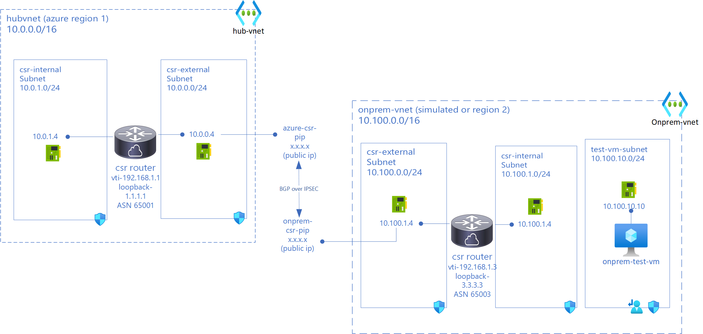

# Azure Hybrid Networking Routing Lab Series

## Lab 1 - Deploying Hub VNET in Azure and Simulated On-Prem then setting up Cisco CSR Routers with BGP over IPSEC

### Intro

This lab deploys 2 CSR Routers one in Azure Hub VNET and one in On-premise (Azure simulated) and IPSec tunnel is established between CSR routers. BGP is established between CSRs. An on-prem test VM is setup to ping CSR on Azure.
*This lab is for testing/learning purposes only and should not be considered production configurations*

### Networking Architecture



### Components in this lab

- Azure Hub Environment
  - hub-vnet(10.0.0.0/16)
  - csr-internal (10.0.1.0/24) and csr-external(10.0.0.0/24) subnets in hub-vnet  
  - azure-csr Cisco CSR (tunnel ip 192.168.1.1) with public ip (azure-csr-pip) and private ips: external interface (10.0.0.4 from csr-external subnet) and internal interface (10.0.1.4 from csr-internal)
  - azure-static-rt UDR on csr-internal and csr-external with only route pointing 0/0 to Internet

- On-premise Environment (simulated on Azure)
  - on-prem vnet (10.100.0.0/16)
  - csr-internal (10.100.1.0/24) and csr-external(10.100.0.0/24) subnets in on-prem vnet
  - onprem-csr Cisco CSR (tunnel ip 192.168.1.3) with public ip (onprem-csr-pip) and private ips: external interface (10.100.0.4 from csr-external subnet) and internal interface (10.100.1.4 from csr-internal)
  - test-vm-subnet (10.100.10.0/24) with onprem-test-vm (10.100.10.10)
  - onprem-static-rt UDR on csr-internal and csr-external with only route pointing 0/0 to Internet
  - onprem-vm-rt UDR on test-vm-subnet

- Connectivity
  - IPSec (IKEV2) tunnel between azure-csr and onprem-csr
  - BGP over IPSec between azure-csr and onprem-csr

### Deployment Steps

You can use either cloud shell or Azure CLI. While Azure Bastion can be used to access VMs, in this lab Serial Console is used for simplicity.

Create Resource Groups

```bash
locazure="eastus"
rgazure="azure-rg-lab"

loconprem="westus2 "
rgonprem="onprem-rg-lab"
```

You may have to accept Cisco CSR Agreement
```azurecli
az vm image terms accept --urn cisco:cisco-csr-1000v:16_12_5-byol:latest
```