# Azure Hybrid Networking Routing Lab Series

## Lab 3 - Deploying PaloAlto VM Series Firewall in Hub VNET and BGP peering PAN with Azure Route Server in Azure

### Introduction

This lab deploys PaloAlto VM Series Firewall (PAN) in Hub VNET and is BGP peered Azure Route Server in Azure Hub. Goal of this lab is to force 0/0 traffic originating from spoke VNETs via PAN.

North-South traffic (to internet) via PAN

East-West traffic (to on-prem) bypasses PAN and goes via CSR in Azure

Spoke-Spoke traffic (via PAN)

> *This lab is for testing/learning purposes only and should not be considered production configurations*

### Networking Architecture

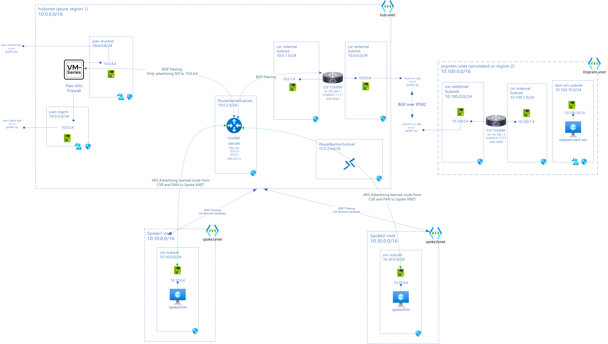

### Expected Traffic Flow after lab 3 deployment

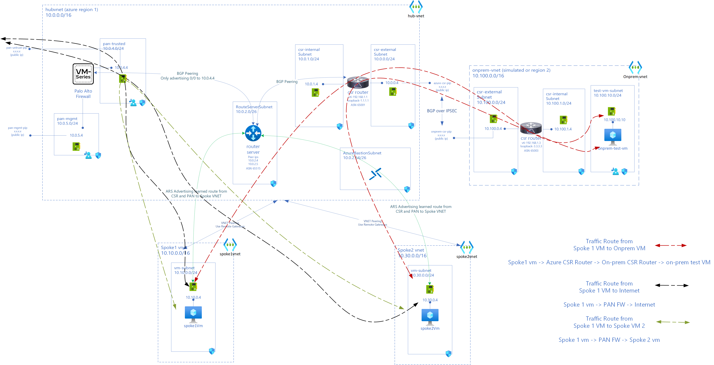

### New Components in lab 3

Azure Hub Environment

- Palo Alto Firewall VM (10.0.4.4) with interfaces in pan-mgt (10.0.5.0/24) subnet and pan-trusted (10.0.4.0/24) subnet
- PAN advertising 0/0 route to 10.0.4.4 to ARS (10.0.2.4 and 10.0.2.5)
- Spoke VNET (spoke2vnet) with address space 10.30.0.0/16
- VM (spoke2-vm) in Spoke VNET (10.30.0.4)

Connectivity

- BGP Peering between PAN (10.0.4.4) and ARS (10.0.2.4 and 10.0.2.5)

VNET Peerings

- Spoke (spoke2vnet) Peered to Hub (hubvnet) with spoke2vnet using remote-gateways in hubvnet

### Existing components from previous labs

Azure Hub Environment

- hub-vnet(10.0.0.0/16)
- csr-internal (10.0.1.0/24) and csr-external(10.0.0.0/24) subnets in hub-vnet  
- azure-csr Cisco CSR (tunnel ip 192.168.1.1) with public ip (azure-csr-pip) and private ips: external interface (10.0.0.4 from csr-external subnet) and internal interface (10.0.1.4 from csr-internal)
- azure-static-rt UDR on csr-internal and csr-external with only route pointing 0/0 to Internet
- Azure Route Server (routeserver-hub) (10.0.2.4 and 10.0.2.5) in subnet 10.0.0.2/26
- Spoke VNET (spoke1vnet) with address space 10.10.0.0/16
- VM (spoke1-vm) in Spoke VNET (10.10.0.4)

On-premise Environment (simulated on Azure)

- on-prem vnet (10.100.0.0/16)
- csr-internal (10.100.1.0/24) and csr-external(10.100.0.0/24) subnets in on-prem vnet
- onprem-csr Cisco CSR (tunnel ip 192.168.1.3) with public ip (onprem-csr-pip) and private ips: external interface (10.100.0.4 from csr-external subnet) and internal interface (10.100.1.4 from csr-internal)
- test-vm-subnet (10.100.10.0/24) with onprem-test-vm (10.100.10.10)
- onprem-static-rt UDR on csr-internal and csr-external with only route pointing 0/0 to Internet
- onprem-vm-rt UDR on test-vm-subnet

- Connectivity
  - IPSec (IKEV2) VPN tunnel between azure-csr (10.0.0.4) and onprem-csr (10.100.0.4)
  - BGP over IPSec between azure-csr (10.0.0.4) and onprem-csr (10.100.0.4)
  - BGP Peering between ARS (10.0.2.4 & 5) and CSR (10.0.1.4)

- VNET Peerings
  - Spoke (spoke1vnet) Peered to Hub (hubvnet) with spoke1vnet using remote-gateways in hubvnet.

### Deployment Steps

You can use either cloud shell or Azure CLI. While Azure Bastion can be used to access VMs, in this lab Serial Console is used for simplicity.

Set Resource Group Variables. Use same values from previous lab

```bash
locazure="eastus"
rgazure="azure-rg-lab"

loconprem="westus2"
rgonprem="onprem-rg-lab"

```

#### Deploy Spoke-2 VNET (spoke2vnet) and peer to (hubvnet)

```bash

#create Spoke2 VNET
az network vnet create --address-prefixes 10.30.0.0/16 -n spoke2Vnet -g $rgazure --subnet-name vm-subnet --subnet-prefixes 10.30.0.0/24 -o none

#create NSG for Subnet and attach to Subnet
az network nsg create -g $rgazure -n "vm-subnet-spoke2-nsg" -l $locazure  -o none
az network vnet subnet update -g $rgazure -n vm-subnet --vnet-name spoke2Vnet --network-security-group "vm-subnet-spoke2-nsg" -o none

# Peer spoke2vnet to hubvnet
hubid=$(az network vnet show -g $rgazure -n hubvnet --query id -o tsv)
spoke2id=$(az network vnet show -g $rgazure -n spoke2Vnet --query id -o tsv)

az network vnet peering create -n "hubTOspoke2" -g $rgazure --vnet-name hubvnet --remote-vnet $spoke2id --allow-vnet-access --allow-forwarded-traffic --allow-gateway-transit -o none
az network vnet peering create -n "spoke2TOhub" -g $rgazure --vnet-name spoke2Vnet --remote-vnet $hubid --allow-vnet-access --allow-forwarded-traffic --use-remote-gateways -o none

#deploy test VM in spoke 2
az network nic create -g $rgazure --vnet-name spoke2Vnet --subnet vm-subnet -n "spoke2-vm-nic" -o none
az vm create -n spoke2-vm \
    -g $rgazure \
    --image ubuntults \
    --size Standard_D2S_v3 \
    --nics spoke2-vm-nic \
    --authentication-type password \
    --admin-username azureuser \
    --admin-password your password \ here  \
    -o none \
    --only-show-errors

```

#### Connectivity between Spokes?

If you ping from spoke1vm to spoke2vm it will not work.

While spoke2-vm nic has learned routes to on-prem from Azure Route Server in Hub, it doesn't have a route to 10.10.0.0/16.
Also, in spoke2-vm-nic 10/8 route points to None as Next Hope Type.

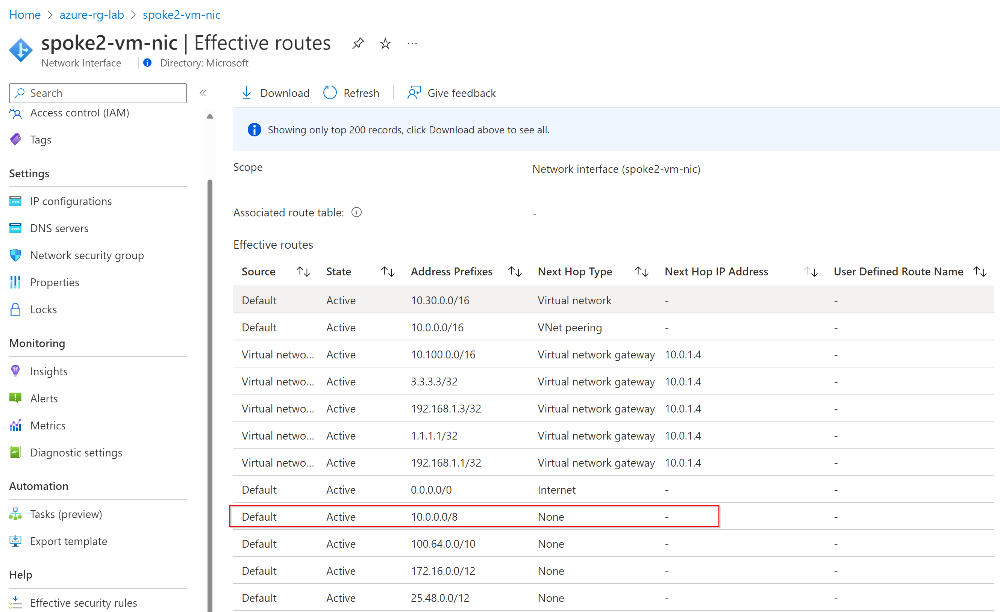

Let's revisit this after deploying PAN

#### Deploy VM Series PaloAlto Firewall in hubvnet

You may have to accept terms if you are deploying this image for first time.

```bash

az vm image terms accept --urn paloaltonetworks:vmseries-flex:byol:latest

```

Create VM Series PA Firewall

```azurecli

# Create NSG for PAN MGMT SUBNET
az network nsg create -g $rgazure -n "subnet-pan-mgmt-nsg" -l $locazure   -o none

az network nsg rule create --resource-group $rgazure --nsg-name subnet-pan-mgmt-nsg --name "Allow-10slash" --access Allow --protocol "*" --direction Inbound --priority 100 --source-address-prefix 10.0.0.0/8 --source-port-range "*" --destination-address-prefix "*" --destination-port-range "*" -o none
az network nsg rule create --resource-group $rgazure --nsg-name subnet-pan-mgmt-nsg --name "Allow-192slash" --access Allow --protocol "*" --direction Inbound --priority 120 --source-address-prefix 192.168.0.0/16 --source-port-range "*" --destination-address-prefix "*" --destination-port-range "*" -o none
az network nsg rule create --resource-group $rgazure --nsg-name subnet-pan-mgmt-nsg --name "Allow-HTTPS" --access Allow --protocol "TCP" --direction Inbound --priority 300 --source-address-prefix "*" --source-port-range "*" --destination-address-prefix "*" --destination-port-range "443" -o none

# Create NSG for PAN TRUSTED SUBNET
az network nsg create -g $rgazure -n "subnet-pan-trusted-nsg" -l $locazure  -o none

az network nsg rule create --resource-group $rgazure --nsg-name subnet-pan-trusted-nsg --name "Allow-10slash" --access Allow --protocol "*" --direction Inbound --priority 100 --source-address-prefix 10.0.0.0/8 --source-port-range "*" --destination-address-prefix "*" --destination-port-range "*" -o none
az network nsg rule create --resource-group $rgazure --nsg-name subnet-pan-trusted-nsg --name "Allow-192slash" --access Allow --protocol "*" --direction Inbound --priority 200 --source-address-prefix 192.168.0.0/16 --source-port-range "*" --destination-address-prefix "*" --destination-port-range "*" -o none

# Create Subnets
az network vnet subnet create --address-prefix 10.0.4.0/24 --name pan-trusted --resource-group $rgazure --vnet-name hubvnet --network-security-group subnet-pan-trusted-nsg -o none
az network vnet subnet create --address-prefix 10.0.5.0/24 --name pan-mgmt --resource-group $rgazure --vnet-name hubvnet --network-security-group subnet-pan-mgmt-nsg -o none

# Create PAN Firewall

# Create PAN NICs
az network public-ip create --name pan-mgmt-pip --resource-group $rgazure --idle-timeout 30 --sku Standard -o none
az network nic create --name pan-mgmt-nic --resource-group $rgazure --subnet pan-mgmt --vnet-name hubvnet --public-ip-address pan-mgmt-pip --private-ip-address 10.0.5.4 --ip-forwarding true -o none
az network nic create --name pan-trust-nic --resource-group $rgazure --subnet pan-trusted --vnet-name hubvnet --private-ip-address 10.0.4.4 --ip-forwarding true -o none

# Create RT for trust-nic and mgmt-nic and apply to subnet
az network route-table create --name pan-mgmt-vm-rt --resource-group $rgazure --disable-bgp-route-propagation true -o none
az network route-table route create --name default --resource-group $rgazure --route-table-name pan-mgmt-vm-rt --address-prefix "0.0.0.0/0" --next-hop-type Internet -o none
az network vnet subnet update --name pan-mgmt --vnet-name hubvnet --resource-group $rgazure --route-table pan-mgmt-vm-rt -o none

az network route-table create --name pan-trusted-vm-rt --resource-group $rgazure -o none
az network route-table route create --name default --resource-group $rgazure --route-table-name pan-trusted-vm-rt --address-prefix "0.0.0.0/0" --next-hop-type Internet -o none
az network vnet subnet update --name pan-trusted --vnet-name hubvnet --resource-group $rgazure --route-table pan-trusted-vm-rt -o none

# Create PAN Series VM
az vm create --resource-group $rgazure \
 --location $locazure \
 --name pan-vmseries-fw \
 --size Standard_D2S_v3 \
 --nics pan-mgmt-nic  pan-trust-nic \
 --image paloaltonetworks:vmseries-flex:byol:latest \
 --admin-username azureuser \
 --admin-password "M@ft123M@ft123" \ 
 -o none \
 --only-show-errors

```

#### Configure VM Series PaloAlto Firewall

For this lab you can import [this config file - lab 3](assets/running-config-Lab3-Final.xml) configuration file to PAN Web Management UI interface.

> When you use this xml, password to login to PAN Web Management UI is "M@ft123M@ft123"

It sets up following

- Network (Interfaces, Zones, Virtual Routers, Interface Mgmt)
- Policies (Security and NAT).
- Ip Address for Trusted PAN NIC is 10.0.4.4
- Configures Static Routes to Azure Route Server in Hubvnet
- Configures route 0/0 to PA interface and redistribute to BGP Peers
- Sets up BGP Peer with ARS (10.0.2.4 & 10.0.2.5) (routeserver-hub ASN 65515)

Import Configuration to PAN:

- Login to <https://public-ip-of-vm-series-fw>

  - You will need accept self signed certificate

- Go to Device -> Setup -> Operations

- Click on Import Named configuration snapshot

- Click on Load Named Configuration snapshot -> Select file which you just imported.

- Click on Commit on right corner.

- Validate that PAN is configured.

#### BGP Peer PAN with ARS in Hub

```bash

#peer from ARS to PAN
az network routeserver peering create --name hub-ars-to-pan --peer-ip 10.0.4.4 --peer-asn 65010 --routeserver routeserver-hub --resource-group $rgazure -o none

```

In the portal you can see BGP Peering established between CSR and PAN in Azure

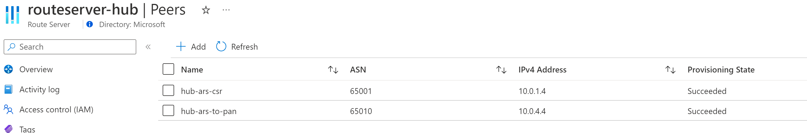

### Check learned routes on Azure Route Server in Hub (routeserver-hub) from PAN

Validate 0/0 route to NVA is learned from PAN

```azurecli

az network routeserver peering list-learned-routes \
    --name hub-ars-to-pan \
    --routeserver routeserver-hub \
    --resource-group $rgazure
```

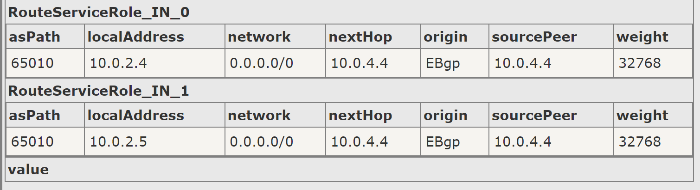

ARS in Hub (routeserver-hub) is advertising spoke routes to peers

```azurecli

az network routeserver peering list-advertised-routes  \
    --name hub-ars-to-pan \
    --routeserver routeserver-hub \
    --resource-group $rgazure
```

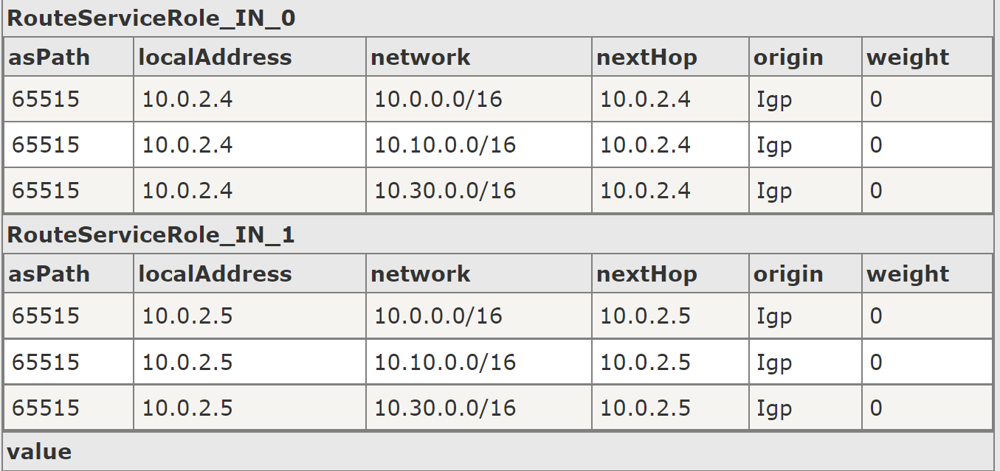

#### Check BGP on PAN (pan-vmseries-fw)

Login to <https://public-ip-of-vm-series-fw> PAN Management Web UI

Navigate to Network -> Virtual Routers

View "default" router runtime stats (click on More Runtime Stats on right column)

Check Route Table


PAN BGP Peers

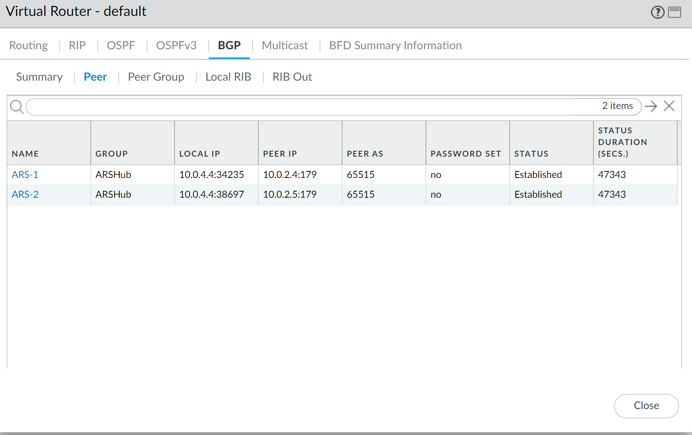

PAN Learned Routes from peers

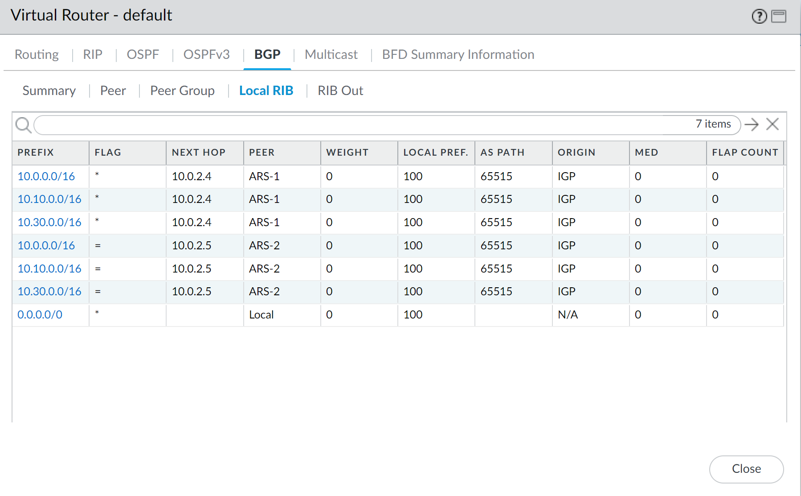

PAN Advertised routes to peers

0/0 route is advertised to ARS in hub

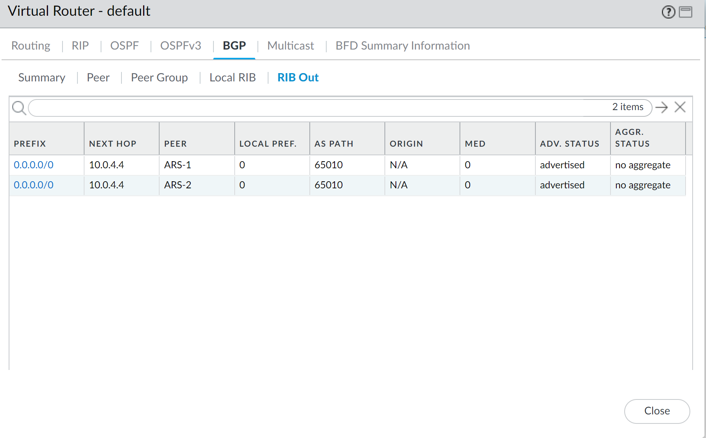

#### Check BGP on Azure CSR (azure-csr)

Login to azure-csr via Serial Console. Navigate to `en` and then `conf t`

`show ip bgp summary`

```bash

azure-csr#show ip bgp summary
BGP router identifier 1.1.1.1, local AS number 65001
BGP table version is 25, main routing table version 25
8 network entries using 1984 bytes of memory
12 path entries using 1632 bytes of memory
3/3 BGP path/bestpath attribute entries using 864 bytes of memory
2 BGP AS-PATH entries using 48 bytes of memory
0 BGP route-map cache entries using 0 bytes of memory
0 BGP filter-list cache entries using 0 bytes of memory
BGP using 4528 total bytes of memory
BGP activity 9/1 prefixes, 39/27 paths, scan interval 60 secs
9 networks peaked at 00:09:20 Oct 13 2022 UTC (13:39:04.315 ago)

Neighbor        V           AS MsgRcvd MsgSent   TblVer  InQ OutQ Up/Down  State/PfxRcd
10.0.2.4        4        65515    2067    2006       25    0    0 1d05h           3
10.0.2.5        4        65515    2062    2002       25    0    0 1d05h           3
192.168.1.3     4        65003    2480    2485       25    0    0 1d13h           3

```

`show ip bgp`

- shows CSR (azure-csr) has learned route to new spoke 2 setup in this lab from ARS (routeserver-hub)

```bash

azure-csr#show ip bgp 
BGP table version is 25, local router ID is 1.1.1.1
Status codes: s suppressed, d damped, h history, * valid, > best, i - internal, 
              r RIB-failure, S Stale, m multipath, b backup-path, f RT-Filter, 
              x best-external, a additional-path, c RIB-compressed, 
              t secondary path, L long-lived-stale,
Origin codes: i - IGP, e - EGP, ? - incomplete
RPKI validation codes: V valid, I invalid, N Not found

     Network          Next Hop            Metric LocPrf Weight Path
 *>   1.1.1.1/32       0.0.0.0                  0         32768 i
 *>   3.3.3.3/32       192.168.1.3              0             0 65003 i
 *    10.0.0.0/16      10.0.2.5                               0 65515 i
 *                     10.0.2.4                               0 65515 i
 *>                    0.0.0.0                  0         32768 i
 *    10.10.0.0/16     10.0.2.5                               0 65515 i
 *>                    10.0.2.4                               0 65515 i
 *    10.30.0.0/16     10.0.2.4                               0 65515 i
 *>                    10.0.2.5                               0 65515 i
 *>   10.100.0.0/16    192.168.1.3              0             0 65003 i
 *>   192.168.1.1/32   0.0.0.0                  0         32768 i
 r>   192.168.1.3/32   192.168.1.3              0             0 65003 i

```

#### Check effective routes of Spoke VMs

Spoke1VM NIC Effective Routes

0/0 traffic next hop is 10.0.4.4 instead of Internet
On-prem routes are via 10.0.1.4 (azure-csr)

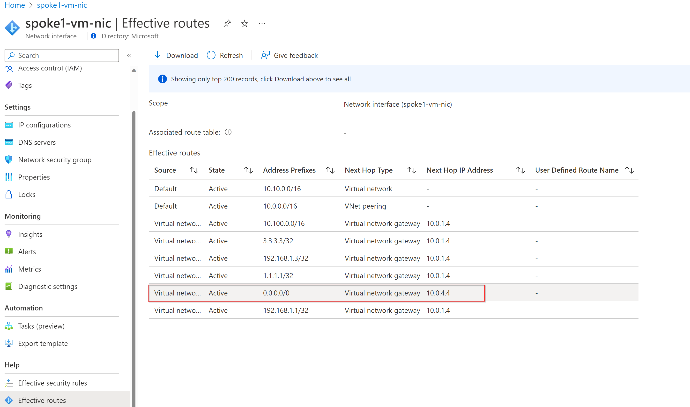

Check same for spoke2vm NIC.

#### Validate connectivity from Spoke1 VM and Spoke 2 VM to VMs, NVAs

From Spoke 1 VM

Ping onprem-test-vm (10.100.10.10)

```bash

azureuser@spoke1-vm:~$ ping 10.100.10.10 -c 2
PING 10.100.10.10 (10.100.10.10) 56(84) bytes of data.
64 bytes from 10.100.10.10: icmp_seq=1 ttl=62 time=72.5 ms
64 bytes from 10.100.10.10: icmp_seq=2 ttl=62 time=77.0 ms

--- 10.100.10.10 ping statistics ---
2 packets transmitted, 2 received, 0% packet loss, time 1001ms
rtt min/avg/max/mdev = 72.565/74.783/77.002/2.235 ms

```

Ping PAN (10.0.4.4)

```bash

azureuser@spoke1-vm:~$ ping 10.0.4.4 -c 2
PING 10.0.4.4 (10.0.4.4) 56(84) bytes of data.
64 bytes from 10.0.4.4: icmp_seq=1 ttl=64 time=2.96 ms
64 bytes from 10.0.4.4: icmp_seq=2 ttl=64 time=1.75 ms

--- 10.0.4.4 ping statistics ---
2 packets transmitted, 2 received, 0% packet loss, time 1001ms
rtt min/avg/max/mdev = 1.754/2.357/2.961/0.605 ms

```

Ping CSR (10.0.1.4)

```bash

azureuser@spoke1-vm:~$ ping 10.0.1.4 -c 2
PING 10.0.1.4 (10.0.1.4) 56(84) bytes of data.
64 bytes from 10.0.1.4: icmp_seq=1 ttl=255 time=4.07 ms
64 bytes from 10.0.1.4: icmp_seq=2 ttl=255 time=16.9 ms

--- 10.0.1.4 ping statistics ---
2 packets transmitted, 2 received, 0% packet loss, time 1001ms
rtt min/avg/max/mdev = 4.079/10.511/16.943/6.432 ms

```

Ping on-prem CSR (10.100.1.4)

```bash

azureuser@spoke1-vm:~$ ping 10.100.1.4 -c 2
PING 10.100.1.4 (10.100.1.4) 56(84) bytes of data.
64 bytes from 10.100.1.4: icmp_seq=1 ttl=254 time=69.6 ms
64 bytes from 10.100.1.4: icmp_seq=2 ttl=254 time=70.2 ms

--- 10.100.1.4 ping statistics ---
2 packets transmitted, 2 received, 0% packet loss, time 1001ms
rtt min/avg/max/mdev = 69.650/69.943/70.237/0.395 ms

```

Ping 8.8.8.8

```bash
#ping 8.8.8.8
azureuser@spoke1-vm:~$ ping 8.8.8.8 -c 2
PING 8.8.8.8 (8.8.8.8) 56(84) bytes of data.
64 bytes from 8.8.8.8: icmp_seq=1 ttl=114 time=3.36 ms
64 bytes from 8.8.8.8: icmp_seq=2 ttl=114 time=3.07 ms

--- 8.8.8.8 ping statistics ---
2 packets transmitted, 2 received, 0% packet loss, time 1001ms
rtt min/avg/max/mdev = 3.073/3.218/3.364/0.156 ms

```

```bash

# traceroute 8.8.8.8 shows 10.0.4.4 (PAN FW) as next hop

azureuser@spoke1-vm:~$ traceroute 8.8.8.8
traceroute to 8.8.8.8 (8.8.8.8), 30 hops max, 60 byte packets
 1  10.0.4.4 (10.0.4.4)  1.937 ms  1.887 ms  2.572 ms^C

```

curl external web url to validate connectivity

```bash

#curl a web page to test connectivity works

azureuser@spoke1-vm:~$ curl -I  www.microsoft.com
HTTP/1.1 200 OK
Accept-Ranges: bytes
Content-Type: text/html
ETag: "6082151bd56ea922e1357f5896a90d0a:1425454794"
Last-Modified: Wed, 04 Mar 2015 07:39:54 GMT
Server: AkamaiNetStorage
Content-Length: 1020
Expires: Thu, 13 Oct 2022 15:45:04 GMT
Cache-Control: max-age=0, no-cache, no-store
Pragma: no-cache
Date: Thu, 13 Oct 2022 15:45:04 GMT
Connection: keep-alive

```

Repeat same steps from Spoke 2 VM to validate connectivity.

#### Check and Validate connectivity between Spokes (spoke 1 vm and spoke 2 vm)

The connectivity between spokes now works via PAN

```bash
#ping from spoke1-vm (10.10.0.4) to spoke2-vm (10.30.0.4)
azureuser@spoke1-vm:~$ ping 10.30.0.4 -c 4
PING 10.30.0.4 (10.30.0.4) 56(84) bytes of data.
64 bytes from 10.30.0.4: icmp_seq=1 ttl=63 time=2.45 ms
64 bytes from 10.30.0.4: icmp_seq=2 ttl=63 time=3.30 ms
64 bytes from 10.30.0.4: icmp_seq=3 ttl=63 time=2.83 ms
64 bytes from 10.30.0.4: icmp_seq=4 ttl=63 time=2.41 ms

--- 10.30.0.4 ping statistics ---
4 packets transmitted, 4 received, 0% packet loss, time 3003ms

#traceroute from spoke1-vm (10.10.0.4) to spoke2-vm (10.30.0.4)

azureuser@spoke1-vm:~$ traceroute 10.30.0.4
traceroute to 10.30.0.4 (10.30.0.4), 30 hops max, 60 byte packets
 1  10.0.4.4 (10.0.4.4)  3.117 ms  2.692 ms  3.053 ms
 2  10.30.0.4 (10.30.0.4)  3.319 ms * *

```

#### Validate Internet Traffic Inspection via PAN

Login to PAN -> Monitor -> Logs -> Traffic

In filter put `addr.dst in 8.8.8.8`

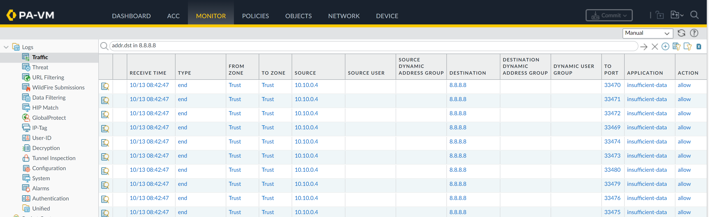

#### Conclusion

In this lab PAN FW was introduced in hub to inspect internet traffic. PAN was peered with ARS via BGP. PAN advertising 0/0 route to ARS.

Validated, North-South traffic (to internet) via PAN. East-West traffic (to on-prem) bypasses PAN and goes via CSR in Azure. Spoke-Spoke traffic (via PAN)
