# Azure Hybrid Networking Routing Lab Series

## Lab 4 - BGP peering PAN with Cisco CSR and evaluate learned/advertised routes across bgp peers

### Introduction

This lab BGP Peers PAN to CSR. This brings in complexity with learned and advertised routes. Lets review in this lab and potential approaches on fixing this.

> *This lab is for testing/learning purposes only and should not be considered production configurations*

### Networking Architecture

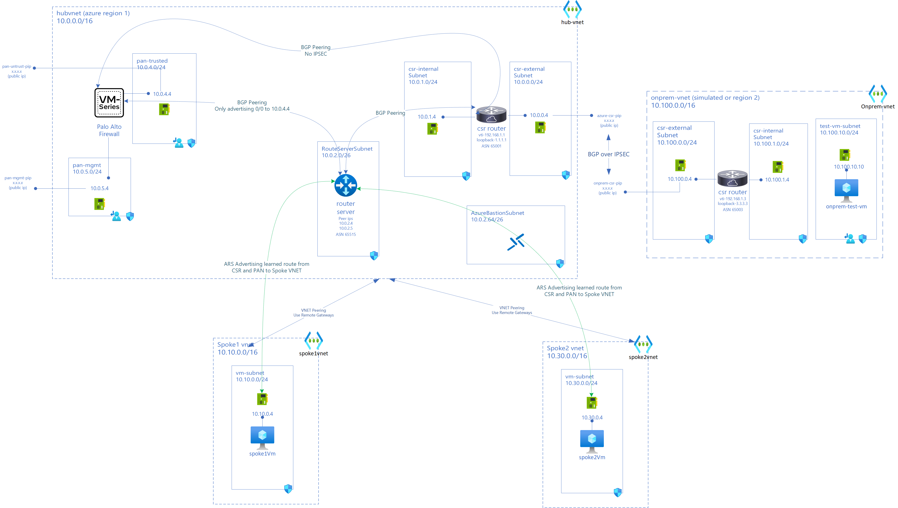

### Expected Traffic Flow after lab 4 deployment

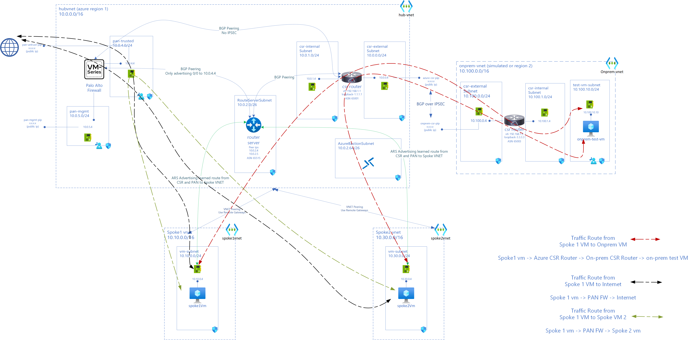

### New Components in lab 4

Connectivity

- BGP Peering between PAN (10.0.4.4) and CSR (10.0.1.4)

### Existing components from previous labs

Azure Hub Environment

- hub-vnet(10.0.0.0/16)
- csr-internal (10.0.1.0/24) and csr-external(10.0.0.0/24) subnets in hub-vnet  
- azure-csr Cisco CSR (tunnel ip 192.168.1.1) with public ip (azure-csr-pip) and private ips: external interface (10.0.0.4 from csr-external subnet) and internal interface (10.0.1.4 from csr-internal)
- azure-static-rt UDR on csr-internal and csr-external with only route pointing 0/0 to Internet
- Azure Route Server (routeserver-hub) (10.0.2.4 and 10.0.2.5) in subnet 10.0.0.2/26
- Palo Alto Firewall VM (10.0.4.4) with interfaces in pan-mgt (10.0.5.0/24) subnet and pan-trusted (10.0.4.0/24) subnet
- PAN advertising 0/0 route to 10.0.4.4 to ARS (10.0.2.4 and 10.0.2.5)
- Spoke VNET (spoke1vnet) with address space 10.10.0.0/16
- VM (spoke1-vm) in Spoke VNET (10.10.0.4)
- Spoke VNET (spoke2vnet) with address space 10.30.0.0/16
- VM (spoke2-vm) in Spoke VNET (10.30.0.4)

On-premise Environment (simulated on Azure)

- on-prem vnet (10.100.0.0/16)
- csr-internal (10.100.1.0/24) and csr-external(10.100.0.0/24) subnets in on-prem vnet
- onprem-csr Cisco CSR (tunnel ip 192.168.1.3) with public ip (onprem-csr-pip) and private ips: external interface (10.100.0.4 from csr-external subnet) and internal interface (10.100.1.4 from csr-internal)
- test-vm-subnet (10.100.10.0/24) with onprem-test-vm (10.100.10.10)
- onprem-static-rt UDR on csr-internal and csr-external with only route pointing 0/0 to Internet
- onprem-vm-rt UDR on test-vm-subnet

- Connectivity
  - IPSec (IKEV2) VPN tunnel between azure-csr (10.0.0.4) and onprem-csr (10.100.0.4)
  - BGP over IPSec between azure-csr (10.0.0.4) and onprem-csr (10.100.0.4)
  - BGP Peering between ARS (10.0.2.4 & 5) and CSR (10.0.1.4)
  - BGP Peering between PAN (10.0.4.4) and ARS (10.0.2.4 & 5) and CSR (10.0.1.4)

- VNET Peerings
  - Spoke (spoke1vnet) Peered to Hub (hubvnet) with spoke1vnet using remote-gateways in hubvnet
  - Spoke (spoke2vnet) Peered to Hub (hubvnet) with spoke2vnet using remote-gateways in hubvnet

### Deployment Steps

You can use either cloud shell or Azure CLI. While Azure Bastion can be used to access VMs, in this lab Serial Console is used for simplicity.

Set Resource Group Variables. Use same values from previous lab

```bash
locazure="eastus"
rgazure="azure-rg-lab"

loconprem="westus2"
rgonprem="onprem-rg-lab"

```

#### Import Configuration Settings for VM Series PaloAlto Firewall

For this lab you can import [this config file - lab 4](assets/running-config-Lab4-initial.xml) configuration file to PAN Web Management UI interface.

> When you use this xml, password to login to PAN Web Management UI is "M@ft123M@ft123"

It sets up following in addition to changes from lab-3

- Configures Static Routes to CSR (azure-csr)
- Sets up BGP Peer with CSR (10.0.1.4) (azure-csr ASN 65001)

(image - here)

Import Configuration to PAN:

- Login to <https://public-ip-of-vm-series-fw>

  - You will need accept self signed certificate

- Go to Device -> Setup -> Operations

- Click on Import Named configuration snapshot

- Click on Load Named Configuration snapshot -> Select file which you just imported.

- Click on Commit on right corner.

- Validate that PAN is configured.

Static route to azure-csr
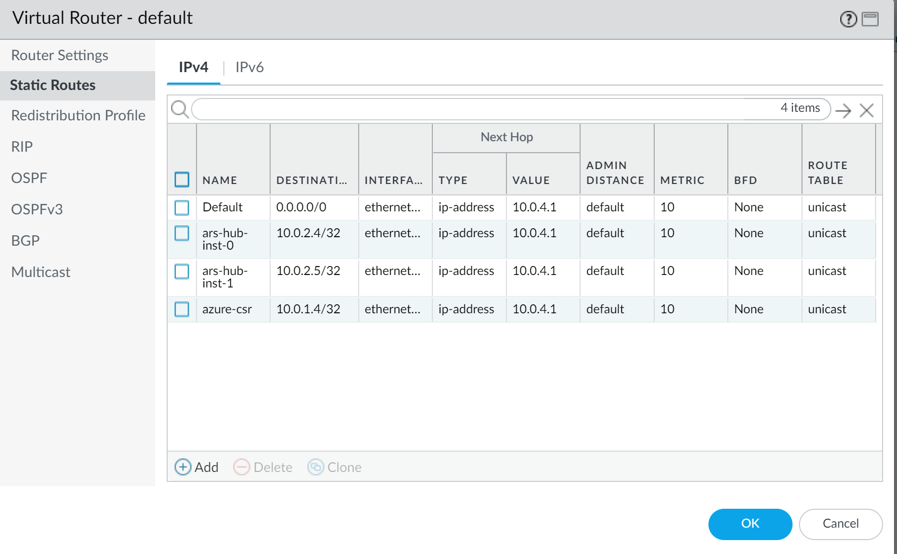

BGP Peer
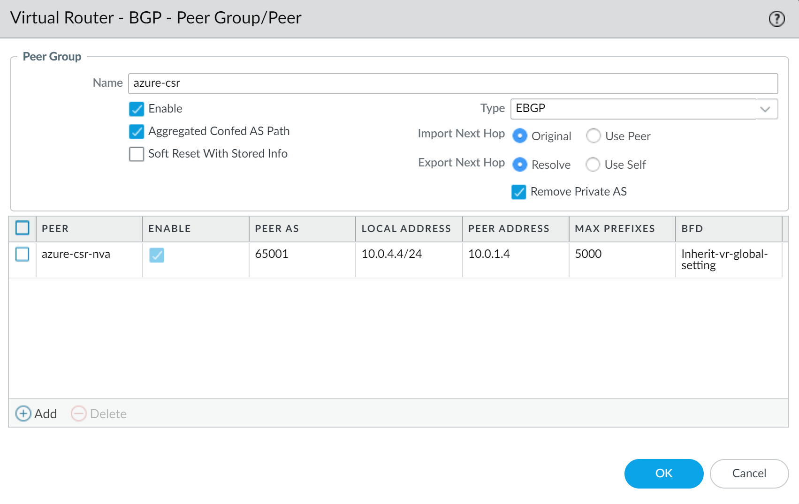

#### BGP Peer azure-csr (CSR) with PAN

Login to azure-csr via Serial Console. Navigate to `en` and then `conf t`
Paste in below configuration, one block at a time in config mode i.e `azure-csr(config)#`

```bash

#static route for PAN 10.0.4.4
ip route 10.0.4.4 255.255.255.255 10.0.1.1

router bgp 65001
 bgp log-neighbor-changes
 neighbor 10.0.4.4 remote-as 65010
 neighbor 10.0.4.4 ebgp-multihop 255
exit

exit

```

After peering with PAN, you would see this neighbor message up in Serial Console

```bash
*Oct 13 00:09:20.015: %BGP-5-ADJCHANGE: neighbor 10.0.4.4 Up 

```

Save configuration to startup in case CSR restarts

```bash

azure-csr# copy running-config startup-config

```

Output when you run copy running-config startup-config

```
azure-csr#copy running-config startup-config
Destination filename [startup-config]? startup-config
Building configuration...
[OK]

```

Validate BGP Peering in azure-csr use `show ip bgp summary`

```bash

azure-csr#show ip bgp summary
BGP router identifier 1.1.1.1, local AS number 65001
BGP table version is 26, main routing table version 26
9 network entries using 2232 bytes of memory
15 path entries using 2040 bytes of memory
5/4 BGP path/bestpath attribute entries using 1440 bytes of memory
3 BGP AS-PATH entries using 72 bytes of memory
0 BGP route-map cache entries using 0 bytes of memory
0 BGP filter-list cache entries using 0 bytes of memory
BGP using 5784 total bytes of memory
BGP activity 10/1 prefixes, 43/28 paths, scan interval 60 secs
9 networks peaked at 00:09:20 Oct 13 2022 UTC (17:08:33.859 ago)

Neighbor        V           AS MsgRcvd MsgSent   TblVer  InQ OutQ Up/Down  State/PfxRcd
10.0.2.4        4        65515    2305    2238       26    0    0 1d09h           3
10.0.2.5        4        65515    2299    2233       26    0    0 1d09h           3
10.0.4.4        4        65010      62      62       26    0    0 00:25:02        3
192.168.1.3     4        65003    2711    2716       26    0    0 1d16h           3

```

Check BGP routes `show ip bgp`

```bash

azure-csr#show ip bgp       
BGP table version is 26, local router ID is 1.1.1.1
Status codes: s suppressed, d damped, h history, * valid, > best, i - internal, 
              r RIB-failure, S Stale, m multipath, b backup-path, f RT-Filter, 
              x best-external, a additional-path, c RIB-compressed, 
              t secondary path, L long-lived-stale,
Origin codes: i - IGP, e - EGP, ? - incomplete
RPKI validation codes: V valid, I invalid, N Not found

     Network          Next Hop            Metric LocPrf Weight Path
 r>   0.0.0.0          10.0.4.4                               0 65010 ?
 *>   1.1.1.1/32       0.0.0.0                  0         32768 i
 *>   3.3.3.3/32       192.168.1.3              0             0 65003 i
 *    10.0.0.0/16      10.0.2.5                               0 65515 i
 *                     10.0.2.4                               0 65515 i
 *>                    0.0.0.0                  0         32768 i
 *    10.10.0.0/16     10.0.4.4                               0 65010 i
 *                     10.0.2.5                               0 65515 i
 *>                    10.0.2.4                               0 65515 i
 *    10.30.0.0/16     10.0.4.4                               0 65010 i
 *                     10.0.2.4                               0 65515 i
 *>                    10.0.2.5                               0 65515 i
 *>   10.100.0.0/16    192.168.1.3              0             0 65003 i
 *>   192.168.1.1/32   0.0.0.0                  0         32768 i
 r>   192.168.1.3/32   192.168.1.3              0             0 65003 i

```

#### Things are broken :(

Try pinging to onprem-test-vm from spoke1 VM. This points towards some kind of loop.

```bash

azureuser@spoke1-vm:~$ ping 10.100.10.10
PING 10.100.10.10 (10.100.10.10) 56(84) bytes of data.
From 10.0.4.4 icmp_seq=1 Time to live exceeded
From 10.0.4.4 icmp_seq=2 Time to live exceeded
From 10.0.4.4 icmp_seq=3 Time to live exceeded
From 10.0.4.4 icmp_seq=4 Time to live exceeded
From 10.0.4.4 icmp_seq=5 Time to live exceeded
From 10.0.4.4 icmp_seq=6 Time to live exceeded
From 10.0.4.4 icmp_seq=7 Time to live exceeded
^C
--- 10.100.10.10 ping statistics ---
7 packets transmitted, 0 received, +7 errors, 100% packet loss, time 6008ms

```

Try traceroute to onprem-test-vm from Spoke1 VM. As you can see circular reference.

```bash

traceroute to 10.100.10.10 (10.100.10.10), 30 hops max, 60 byte packets
 1  10.0.4.4 (10.0.4.4)  2.491 ms  1.952 ms  2.430 ms
 2  10.0.4.4 (10.0.4.4)  3.111 ms  3.666 ms  3.270 ms
 3  10.0.4.4 (10.0.4.4)  4.053 ms  4.019 ms  3.637 ms
 4  10.0.4.4 (10.0.4.4)  4.004 ms  3.967 ms  4.280 ms
 5  10.0.4.4 (10.0.4.4)  3.663 ms  3.936 ms  4.356 ms
 6  10.0.4.4 (10.0.4.4)  4.662 ms  2.861 ms  2.406 ms
 7  10.0.4.4 (10.0.4.4)  2.463 ms  4.567 ms  4.540 ms
 8  10.0.4.4 (10.0.4.4)  5.212 ms  5.800 ms  5.178 ms
 9  10.0.4.4 (10.0.4.4)  5.766 ms  5.749 ms  5.312 ms
10  10.0.4.4 (10.0.4.4)  5.735 ms  5.830 ms  5.684 ms
11  10.0.4.4 (10.0.4.4)  5.963 ms  5.694 ms  5.654 ms
12  10.0.4.4 (10.0.4.4)  4.462 ms  4.714 ms  3.194 ms
13  10.0.4.4 (10.0.4.4)  3.608 ms  3.638 ms  3.578 ms
14  10.0.4.4 (10.0.4.4)  3.659 ms  6.928 ms  6.906 ms
15  10.0.4.4 (10.0.4.4)  7.550 ms  7.569 ms  7.281 ms
16  10.0.4.4 (10.0.4.4)  7.963 ms  7.484 ms  7.931 ms
17  10.0.4.4 (10.0.4.4)  8.162 ms  8.146 ms  7.581 ms
18  10.0.4.4 (10.0.4.4)  5.834 ms  6.687 ms  6.964 ms
19  10.0.4.4 (10.0.4.4)  6.466 ms  6.300 ms  6.595 ms
20  10.0.4.4 (10.0.4.4)  6.565 ms  6.195 ms  6.173 ms
21  10.0.4.4 (10.0.4.4)  6.323 ms  6.303 ms  6.398 ms
22  10.0.4.4 (10.0.4.4)  5.291 ms  5.643 ms  5.251 ms
23  10.0.4.4 (10.0.4.4)  5.866 ms  5.848 ms  12.103 ms
24  10.0.4.4 (10.0.4.4)  12.081 ms  11.089 ms  10.590 ms
25  10.0.4.4 (10.0.4.4)  12.262 ms  11.323 ms  12.548 ms
26  10.0.4.4 (10.0.4.4)  11.429 ms  11.970 ms  11.955 ms
27  10.0.4.4 (10.0.4.4)  13.047 ms  12.770 ms  12.748 ms
28  10.0.4.4 (10.0.4.4)  13.050 ms  13.034 ms  13.151 ms
29  10.0.4.4 (10.0.4.4)  11.179 ms  10.911 ms  10.420 ms
30  10.0.4.4 (10.0.4.4)  10.598 ms  7.750 ms  7.958 ms

```

Login back to PAN Web Management UI.

Once BGP peering is done, click on PAN "More Runtime Stats"

Navigate to BGP Tab -> Peer Group

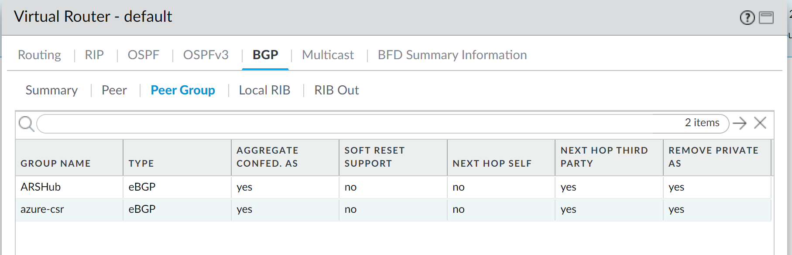

Navigate to Local RIB

PAN has learned routes from Azure CSR

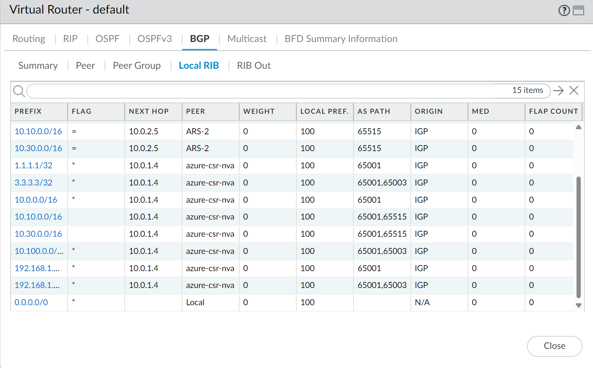

PAN Advertising routes

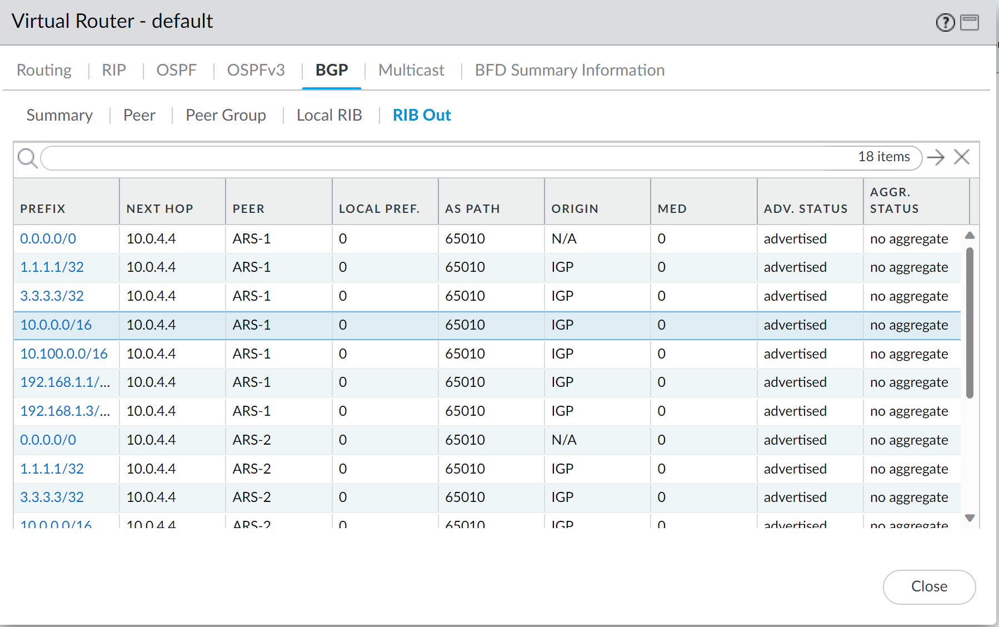

As you can see, PAN is advertising CSR routes next hop as itself to peers.

Check learned routes on Azure Route Server in Hub (routeserver-hub)

```azurecli

az network routeserver peering list-learned-routes \
    --name hub-ars-to-pan \
    --routeserver routeserver-hub \
    --resource-group $rgazure

```

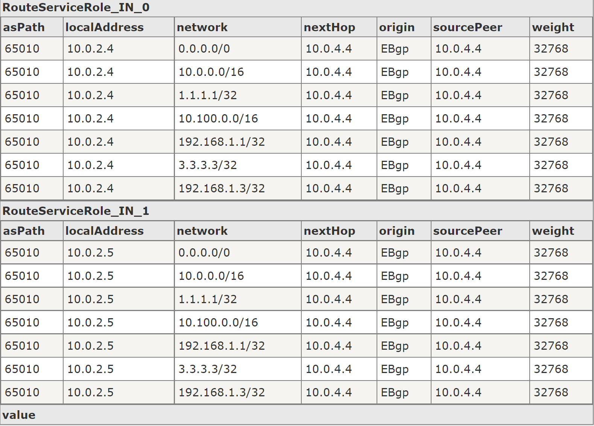

Check spoke1-vm-nic effective routes.

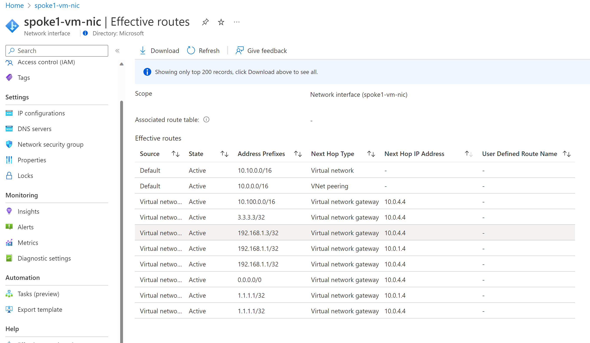

What is happening?

Connectivity from Spoke
Ping from spoke1vm (10.10.0.4) to azure-csr (10.0.1.4) works

Ping from spoke1vm (10.10.0.4) to azure-csr (10.0.4.4) works

Ping from spoke1vm (10.10.0.4) to spoke1vm (10.30.0.4) works

Ping from spoke1vm (10.10.0.4) to onprem-csr (10.100.1.4) does not work

Ping from spoke1vm (10.10.0.4) to onprem-test-vm (10.100.10.10) does not work

Connectivity from on-prem
Ping from onprem-test-vm (10.100.10.10) to azure-csr (10.0.1.4) works

Ping from onprem-test-vm (10.100.10.10) to PAN (10.0.4.4) does not work

Ping from onprem-test-vm (10.100.10.10) to spoke1vm (10.10.0.4) does not work

There are multiple factors affecting:

- PAN is injecting next hop as to itself to on-prem routes
- Since PAN (pan-vmseries-fw) and Azure CSR (azure-csr) are in hub where ARS is resides its also injects routes to NICS of PAN and CSR creating circular reference.

#### What is the goal? Let's explore options

Goal of this lab series is drive all north-south and east-west traffic (on-prem and between spokes) via PaloAlto Firewall. Also to avoid any UDRs.

There are few approaches which can be done in PAN Firewall when peering CSR to BGP. These approaches doesn't fix forcing on-prem traffic via PAN but it will allow PAN to learn CSR routes.

> Both of following changes to PAN are also available as an import vai xml. Follow steps above to import approach 1 or 2 to test out scenario

##### Approach 1 - PAN Does not advertise CSR routes to peers

It is possible to use Export Policy on PAN BGP to not re-advertise routes learned from azure-csr and only advertise 0.0 route as following.

Login to <https://public-ip-of-vm-series-fw> and login to PAN Web UI Management

###### Import Option (approach 1)

[Use this file - lab 4 approach 1](assets/running-config-Lab4-Approach1.xml) and import configuration following steps on top of the lab.

###### UI Option (approach 1)

Manual Steps:

Navigate to Virtual Router -> Default -> BGP -> Export

Create 2 export policies:

First only allow 0/0 route to be advertised.
Second don't re-advertise routes learned from azure-csr.

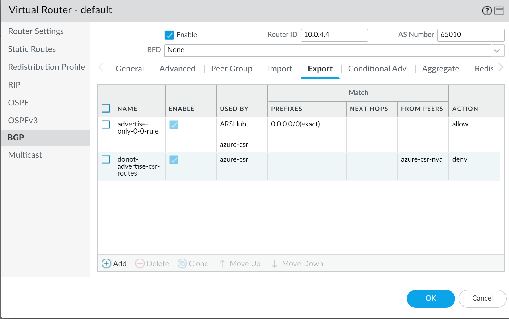

Now only 0/0 route is advertised from PAN to peers (ARS and CSR)
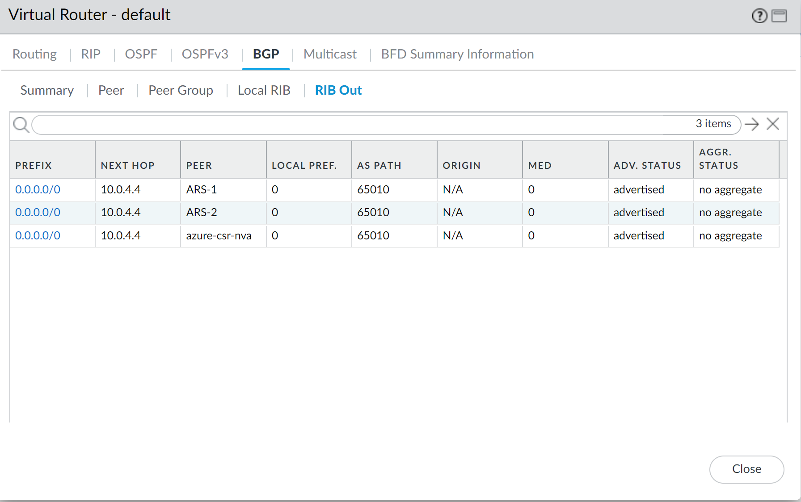

##### Approach 2 - Update BGP Peering between PAN and CSR and configure ebgp -> import next hop from CSR

Login to <https://public-ip-of-vm-series-fw> and login to PAN Web UI Management

###### Import Option (approach 2)

[Use this file - lab 4 approach 2](assets/running-config-Lab4-Approach2.xml) and import configuration following steps on top of the lab.

###### UI Option (approach 2)

Manual Steps

Navigate to Virtual Router -> Default -> BGP -> Peer Group -> Click on azure-csr

Select "User Peer" for Import Next Hop

Select "Use self" for Export Next Hop

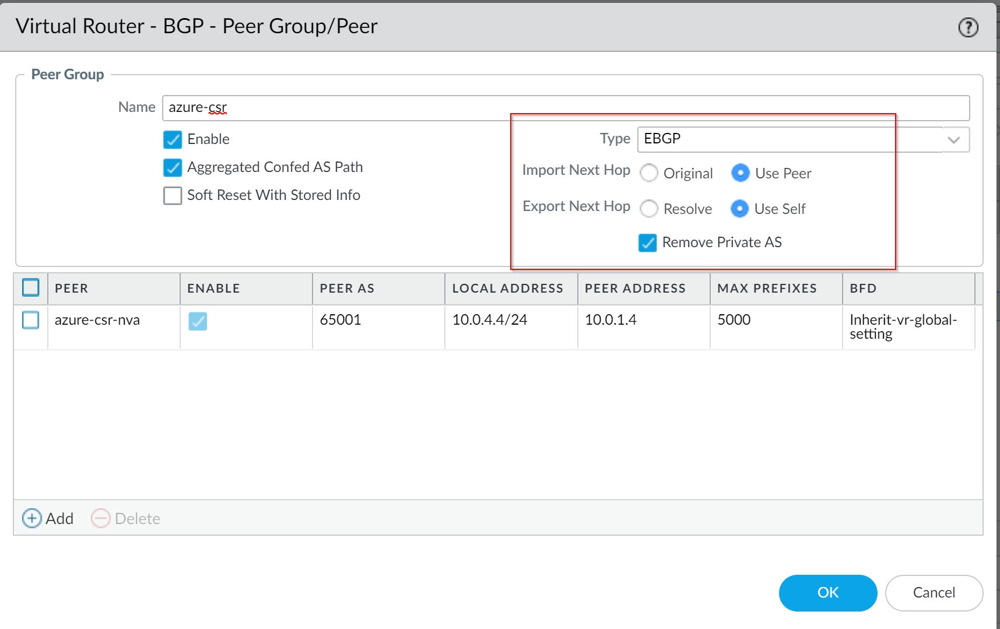

Commit PAN configuration changes and check advertised route. As you can see now it passes CSR routes as is to Azure Router server in hub

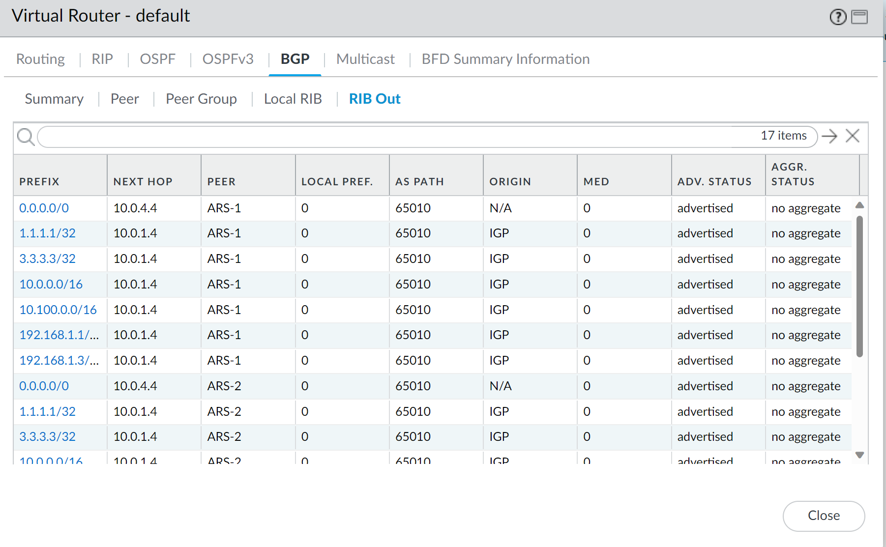

Check Effective Route for spoke1-vm and test connectivity across Spokes and On-prem

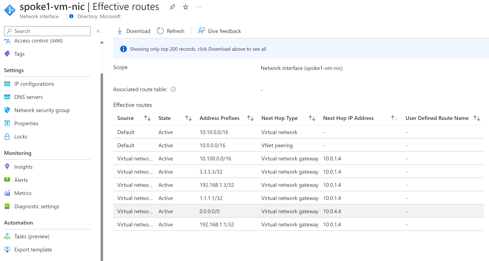

Check connectivity from Spoke1-vm to onprem-test-vm

```bash

azureuser@spoke1-vm:~$ ping 10.100.10.10 -c 4
PING 10.100.10.10 (10.100.10.10) 56(84) bytes of data.
64 bytes from 10.100.10.10: icmp_seq=1 ttl=62 time=71.1 ms
64 bytes from 10.100.10.10: icmp_seq=2 ttl=62 time=69.7 ms
64 bytes from 10.100.10.10: icmp_seq=3 ttl=62 time=71.3 ms
64 bytes from 10.100.10.10: icmp_seq=4 ttl=62 time=71.9 ms

--- 10.100.10.10 ping statistics ---
4 packets transmitted, 4 received, 0% packet loss, time 3004ms
rtt min/avg/max/mdev = 69.723/71.047/71.971/0.843 ms

```

Check connectivity from onprem-test-vm to Spoke1-vm

```bash

azureuser@onprem-test-vm:~$ ping 10.10.0.4 -c 4
PING 10.10.0.4 (10.10.0.4) 56(84) bytes of data.
64 bytes from 10.10.0.4: icmp_seq=1 ttl=62 time=72.6 ms
64 bytes from 10.10.0.4: icmp_seq=2 ttl=62 time=71.1 ms
64 bytes from 10.10.0.4: icmp_seq=3 ttl=62 time=69.5 ms
64 bytes from 10.10.0.4: icmp_seq=4 ttl=62 time=72.9 ms

--- 10.10.0.4 ping statistics ---
4 packets transmitted, 4 received, 0% packet loss, time 3002ms
rtt min/avg/max/mdev = 69.545/71.579/72.992/1.367 ms

```

#### Conclusion

While above approaches help fix routing challenge brought by peering PAN to CSR it still doesn't force on-prem traffic via PAN. In the next lab we will explore one approach to do it.
