# Azure Hybrid Networking Routing Lab Series

## Lab 4 - BGP peering PAN with Cisco CSR and evaluate learned/advertised routes across bgp peers

### Introduction

This lab is focussed on forcing all traffic via PAN FW. In current setup since Azure Route Server in hub spoke VNETs are learning routes to on-prem directly and bypasses PAN FW setup. You can use UDRs in spoke to force traffic via PAN FW but this lab demonstrates more dynamic approach using two route servers.

Spoke VNETs will peer with transit-vnet and learn only routes advertised by routeserver in transit VNET. Routeserver in transit VNET will be BGP peered with PAN in hub which will propagate routes it has learned from Azure CSR. (azure-csr) in hub

> *This lab is for testing/learning purposes only and should not be considered production configurations*

### Networking Architecture

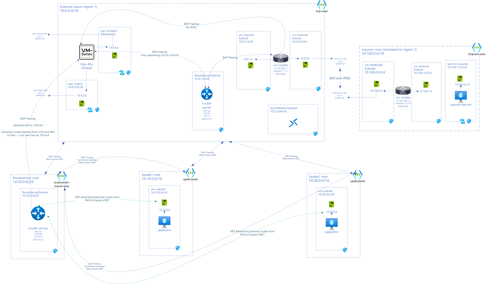

### Expected Traffic Flow after lab 4 deployment

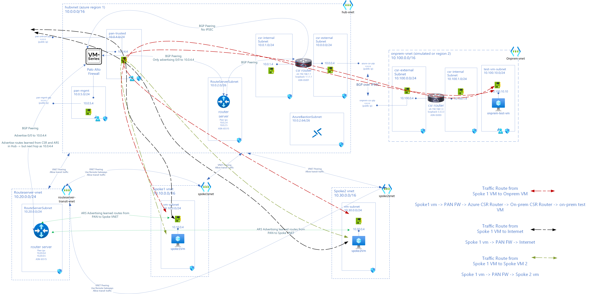

### New Components in lab 4

Azure Hub Environment

- Transit VNET to host Azure Route Server
- transit-vnet (10.20.0.0/16)
- routeserver-transit subnet (10.20.0.0/24)

Connectivity

- BGP Peering between PAN and routeserver-transit

VNET Peerings

- Spoke (spoke1vnet) Peered to Hub (transit-vnet) using remote-gateways in transit-vnet
- Spoke (spoke2vnet) Peered to Hub (transit-vnet)  using remote-gateways in transit-vnet
- Spoke (spoke1vnet) Peered to Hub (hubvnet) not using remote-gateways in hubvnet
- Spoke (spoke2vnet) Peered to Hub (hubvnet) not using remote-gateways in hubvnet
- transit-vnet Peered to Hub (hubvnet) not using remote-gateways

### Existing components from previous labs

Azure Hub Environment

- hub-vnet(10.0.0.0/16)
- csr-internal (10.0.1.0/24) and csr-external(10.0.0.0/24) subnets in hub-vnet  
- azure-csr Cisco CSR (tunnel ip 192.168.1.1) with public ip (azure-csr-pip) and private ips: external interface (10.0.0.4 from csr-external subnet) and internal interface (10.0.1.4 from csr-internal)
- azure-static-rt UDR on csr-internal and csr-external with only route pointing 0/0 to Internet
- Azure Route Server (routeserver-hub) (10.0.2.4 and 10.0.2.5) in subnet 10.0.0.2/26
- Palo Alto Firewall VM (10.0.4.4) with interfaces in pan-mgt (10.0.5.0/24) subnet and pan-trusted (10.0.4.0/24) subnet
- PAN advertising 0/0 route to 10.0.4.4 to ARS (10.0.2.4 and 10.0.2.5)
- Spoke VNET (spoke1vnet) with address space 10.10.0.0/16
- VM (spoke1-vm) in Spoke VNET (10.10.0.4)
- Spoke VNET (spoke2vnet) with address space 10.30.0.0/16
- VM (spoke2-vm) in Spoke VNET (10.30.0.4)

On-premise Environment (simulated on Azure)

- on-prem vnet (10.100.0.0/16)
- csr-internal (10.100.1.0/24) and csr-external(10.100.0.0/24) subnets in on-prem vnet
- onprem-csr Cisco CSR (tunnel ip 192.168.1.3) with public ip (onprem-csr-pip) and private ips: external interface (10.100.0.4 from csr-external subnet) and internal interface (10.100.1.4 from csr-internal)
- test-vm-subnet (10.100.10.0/24) with onprem-test-vm (10.100.10.10)
- onprem-static-rt UDR on csr-internal and csr-external with only route pointing 0/0 to Internet
- onprem-vm-rt UDR on test-vm-subnet

- Connectivity
  - IPSec (IKEV2) VPN tunnel between azure-csr (10.0.0.4) and onprem-csr (10.100.0.4)
  - BGP over IPSec between azure-csr (10.0.0.4) and onprem-csr (10.100.0.4)
  - BGP Peering between ARS (10.0.2.4 & 5) and CSR (10.0.1.4)
  - BGP Peering between PAN (10.0.4.4) and ARS (10.0.2.4 & 5) and CSR (10.0.1.4)
  - BGP Peering between PAN (10.0.4.4) and CSR (10.0.1.4)

- VNET Peerings (updated in this lab)
  - ~~Spoke (spoke1vnet) Peered to Hub (hubvnet) with spoke1vnet using remote-gateways in hubvnet~~
  - ~~Spoke (spoke2vnet) Peered to Hub (hubvnet) with spoke2vnet using remote-gateways in hubvnet~~

### Deployment Steps

You can use either cloud shell or Azure CLI. While Azure Bastion can be used to access VMs, in this lab Serial Console is used for simplicity.

Set Resource Group Variables. Use same values from previous lab

```bash
locazure="eastus"
rgazure="azure-rg-lab"

loconprem="westus2"
rgonprem="onprem-rg-lab"

```

#### Deploy Transit VNET (transit-vnet)

```azurecli

# create transit-vnet and route-server subnet
az network vnet create --name transit-vnet --resource-group $rgazure --address-prefix 10.20.0.0/24 --subnet-name RouteServerSubnet  --subnet-prefix 10.20.0.0/24 -o none

```

#### Deploy Route Server In Transit VNET

```azurecli

# deploy route server in it.
subnet_id=$(az network vnet subnet show --name RouteServerSubnet --resource-group $rgazure --vnet-name transit-vnet --query id -o tsv) 

az network public-ip create --name ars-transit-pip --resource-group $rgazure --version IPv4 --sku Standard --output none --only-show-errors

az network routeserver create \
    --name routeserver-transit \
    --resource-group $rgazure \
    --hosted-subnet $subnet_id \
    --public-ip-address ars-transit-pip \
    --output none

```

#### Create VNET peering between hubvnet and transit-vnet

```azurecli

# get vnet ids
transitid=$(az network vnet show -g $rgazure -n transit-vnet --query id -o tsv)
hubid=$(az network vnet show -g $rgazure -n hubvnet --query id -o tsv)
spoke1id=$(az network vnet show -g $rgazure -n spoke1Vnet --query id -o tsv)
spoke2id=$(az network vnet show -g $rgazure -n spoke2Vnet --query id -o tsv)


# create peering between hubvnet and transit-vnet
az network vnet peering create -n "hub-to-transit" -g $rgazure --vnet-name hubvnet --remote-vnet $transitid --allow-vnet-access --allow-forwarded-traffic -o none
az network vnet peering create -n "transit-to-hub" -g $rgazure --vnet-name transit-vnet --remote-vnet $hubid --allow-vnet-access --allow-forwarded-traffic -o none

```

#### Update VNET peering between Spoke VNETs (spoke1vnet and spoke2vnet) to hub-vnet - disable use remote gateways

```azurecli

# update spoke1 and hub vnet peering (disable remote gateways)

az network vnet peering update -g $rgazure -n hubTOspoke1 --vnet-name hubvnet --set allowGatewayTransit=false -o none
az network vnet peering update -g $rgazure -n spoke1TOhub --vnet-name spoke1Vnet --set useRemoteGateways=false -o none

# update spoke2 and hub vnet peering (disable remote gateways)

az network vnet peering update -g $rgazure -n hubTOspoke2 --vnet-name hubvnet --set allowGatewayTransit=false -o none
az network vnet peering update -g $rgazure -n spoke2TOhub --vnet-name spoke1Vnet --set useRemoteGateways=false -o none

```

#### Create VNET peering between Spoke VNETs (spoke1vnet and spoke2vnet) to transit-vnet with use remote gateways enabled

```azurecli

# vnet peer spoke 1 to transit vnet
az network vnet peering create -n "transit-to-spoke1" -g $rgazure --vnet-name transit-vnet --remote-vnet $spoke1id --allow-vnet-access --allow-forwarded-traffic --allow-gateway-transit -o none
az network vnet peering create -n "spoke1-to-transit" -g $rgazure --vnet-name spoke1Vnet --remote-vnet $transitid --allow-vnet-access --allow-forwarded-traffic --use-remote-gateways -o none

# vnet peer spoke 2 to transit vnet
az network vnet peering create -n "transit-to-spoke2" -g $rgazure --vnet-name transit-vnet --remote-vnet $spoke2id --allow-vnet-access --allow-forwarded-traffic --allow-gateway-transit -o none
az network vnet peering create -n "spoke2-to-transit" -g $rgazure --vnet-name spoke2Vnet --remote-vnet $transitid --allow-vnet-access --allow-forwarded-traffic --use-remote-gateways -o none

```

#### Create BGP Peering with routeserver-transit to PAN in Hub

```azurecli

#peer from Transit ARS to PAN in Hub
az network routeserver peering create --name transit-ars-to-pan --peer-ip 10.0.4.4 --peer-asn 65010 --routeserver routeserver-transit --resource-group $rgazure

```

#### Configure PaltoAlto (PAN) in Hub and BGP Peer with routeserver in transit

For this lab you can import [this config file](assets/running-config-Lab5.xml) configuration file to PAN Web Management UI interface.

> When you use this xml, password to login to PAN Web Management UI is "M@ft123M@ft123"

It adds following to previous configuration

- BGP Peering between PAN to routeserver-transit
- Static routes to route server transit instances (10.20.0.4 and 10.20.0.5)
- While importing CSR routes next hop is imported from peer (approach 2 in lab 4)
- Advertises routes with next hop as PAN Firewall IP to routeserver-transit

Import Configuration to PAN:

- Login to <https://public-ip-of-vm-series-fw>

  - You will need accept self signed certificate

- Go to Device -> Setup -> Operations

- Click on Import Named configuration snapshot

- Click on Load Named Configuration snapshot -> Select file which you just imported.

- Click on Commit on right corner.

- Validate that PAN is configured.

#### Validate PAN Configuration and advertised routes by PAN

Check static routes

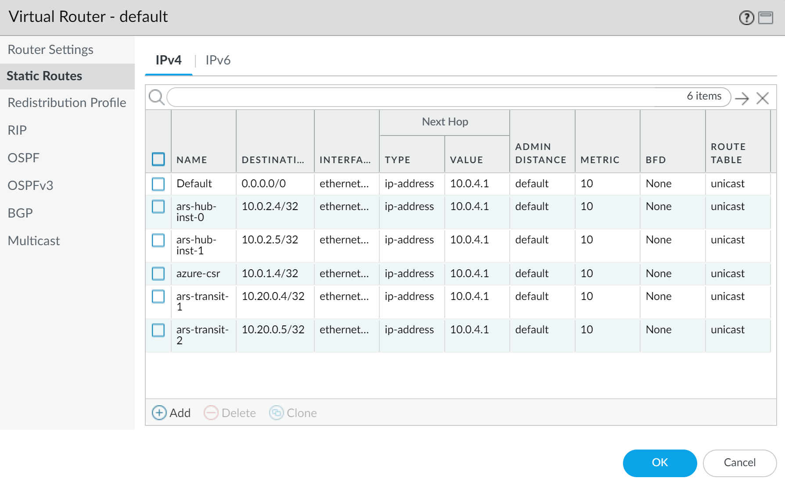

routeserver-transit BGP Peer configuration

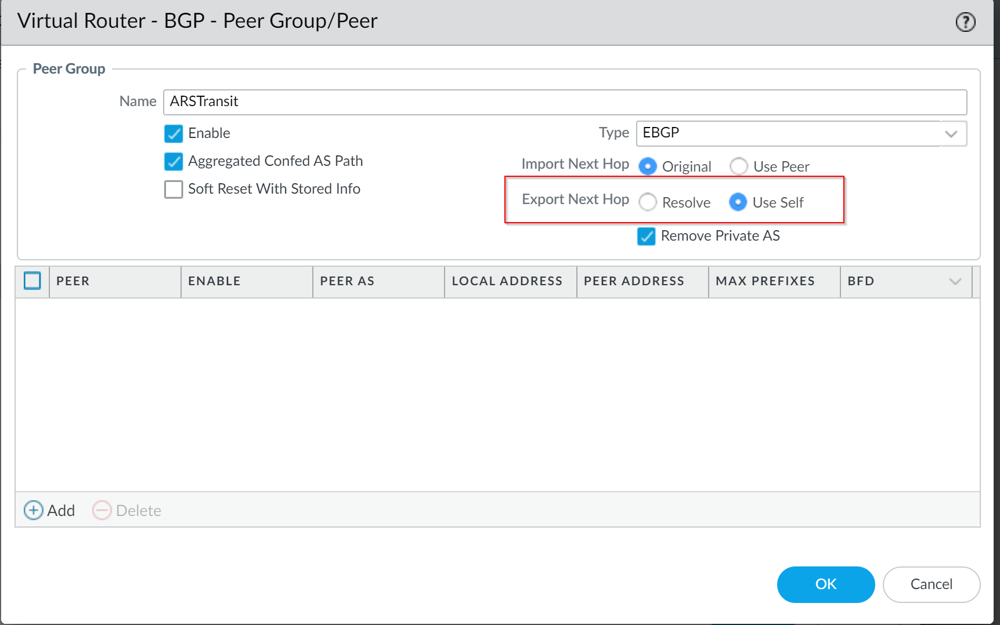

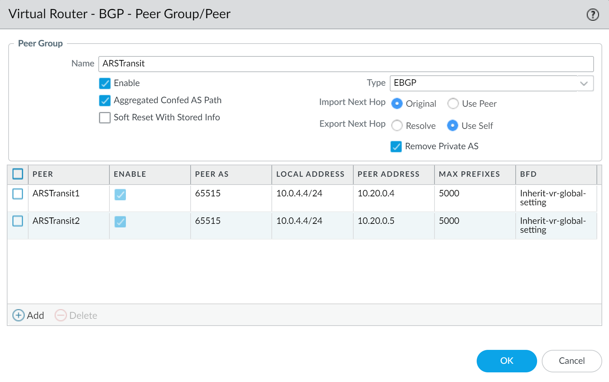

CSR (azure-csr) BGP Peer Configuration


Check Advertised routes by PAN

PAN advertising routes to routeserver in transit. See next hop as 10.0.4.4 for routes to on-prem

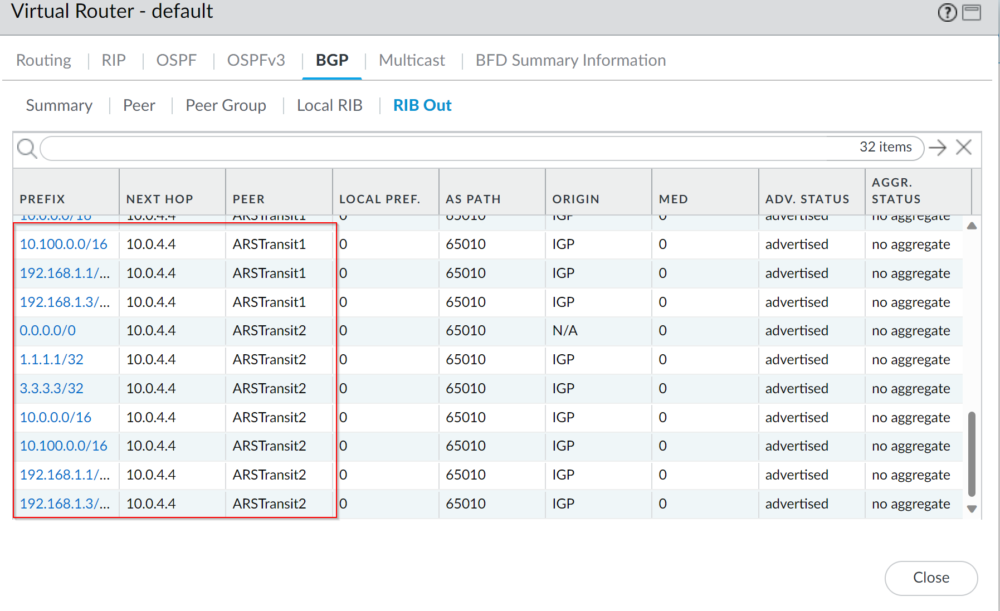

PAN advertising routes to routeserver in hub. See next hop as 10.0.1.4 for route to on-prem

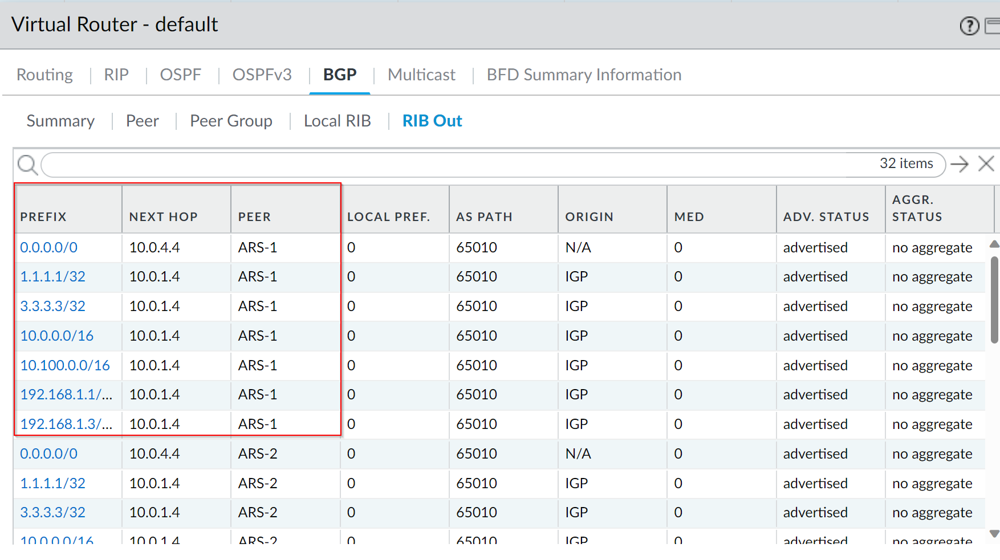

#### Check routeserver-transit learned routes from PAN

```azurecli

az network routeserver peering list-learned-routes \
 --name transit-ars-to-pan \
 --routeserver routeserver-transit \
 --resource-group $rgazure 

```

transit-route server learning routes from PAN

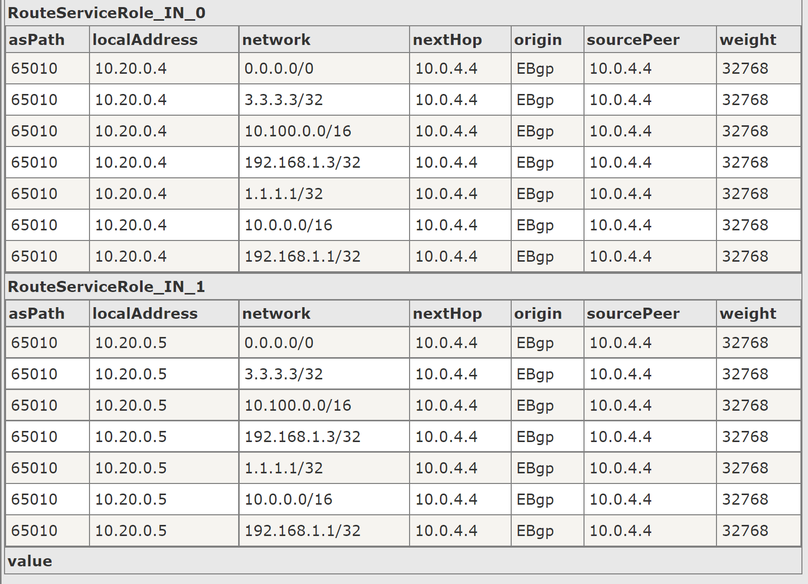

#### Check routeserver-hub learned routes from PAN and CSR

```azurecli

az network routeserver peering list-learned-routes \
 --name hub-ars-to-pan \
 --routeserver routeserver-hub \
 --resource-group $rgazure

```

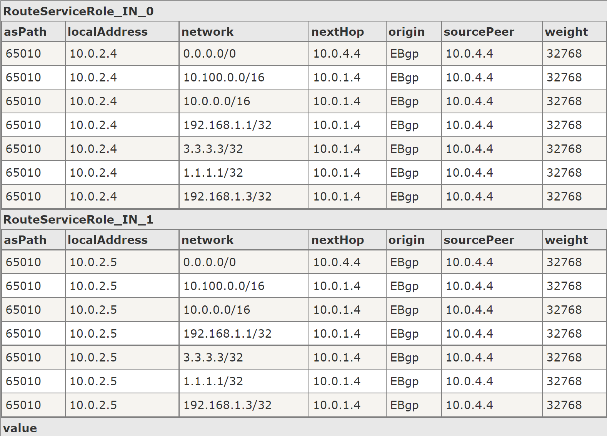

```azurecli

az network routeserver peering list-learned-routes \
 --name hub-ars-csr \
 --routeserver routeserver-hub \
 --resource-group $rgazure

```

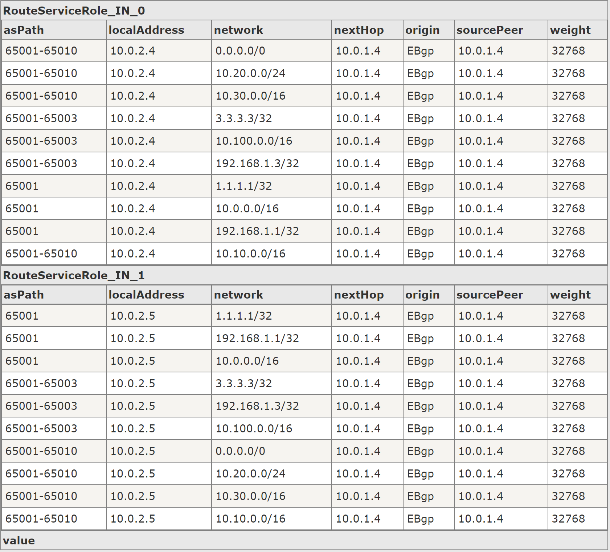

#### Check Spoke VM (effective routes)

Check spoke1-vm-nic effective routes

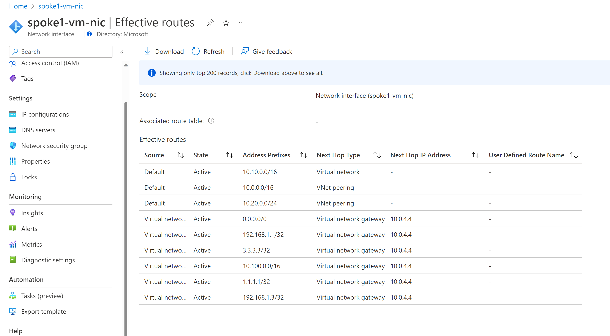

Similarly, you can check spoke2-vm-nic effective routes.

#### Validate Connectivity from Spoke VMs to Internet, On-prem and other spoke VNETs

##### Validate Spoke1 VM to On-prem test VM and traffic flow

`ping 10.100.10.10 -c 4`

```bash

azureuser@spoke1-vm:~$ ping 10.100.10.10 -c 4
PING 10.100.10.10 (10.100.10.10) 56(84) bytes of data.
64 bytes from 10.100.10.10: icmp_seq=1 ttl=62 time=71.4 ms
64 bytes from 10.100.10.10: icmp_seq=2 ttl=62 time=71.6 ms
64 bytes from 10.100.10.10: icmp_seq=3 ttl=62 time=71.4 ms
64 bytes from 10.100.10.10: icmp_seq=4 ttl=62 time=70.4 ms

--- 10.100.10.10 ping statistics ---
4 packets transmitted, 4 received, 0% packet loss, time 3004ms
rtt min/avg/max/mdev = 70.453/71.236/71.606/0.456 ms

```

`traceroute 10.100.10.10`

```bash
azureuser@spoke1-vm:~$ traceroute 10.100.10.10
traceroute to 10.100.10.10 (10.100.10.10), 30 hops max, 60 byte packets
 1  10.0.4.4 (10.0.4.4)  2.567 ms  2.946 ms  2.927 ms
 2  10.0.1.4 (10.0.1.4)  5.393 ms  5.374 ms  5.358 ms
 3  192.168.1.3 (192.168.1.3)  71.145 ms  71.129 ms  71.113 ms
 4  10.100.10.10 (10.100.10.10)  74.933 ms  74.917 ms  74.902 ms

```

Notice the path from spoke1-vm goes to PAN to CSR to on-prem. 

Validate ping/traceroute from spoke2 vm.

##### Validate Spoke1 VM to Spoke2 VM and traffic flow

`ping 10.30.0.4 -c 4`

```bash
azureuser@spoke1-vm:~$ ping 10.30.0.4 -c 4
PING 10.30.0.4 (10.30.0.4) 56(84) bytes of data.
64 bytes from 10.30.0.4: icmp_seq=1 ttl=63 time=2.88 ms
64 bytes from 10.30.0.4: icmp_seq=2 ttl=63 time=2.48 ms
64 bytes from 10.30.0.4: icmp_seq=3 ttl=63 time=6.02 ms
64 bytes from 10.30.0.4: icmp_seq=4 ttl=63 time=2.79 ms

--- 10.30.0.4 ping statistics ---
4 packets transmitted, 4 received, 0% packet loss, time 3004ms
rtt min/avg/max/mdev = 2.487/3.547/6.022/1.437 ms

```

`traceroute 10.30.0.4`

```bash

azureuser@spoke1-vm:~$ traceroute 10.30.0.4
traceroute to 10.30.0.4 (10.30.0.4), 30 hops max, 60 byte packets
 1  10.0.4.4 (10.0.4.4)  3.795 ms  3.754 ms  4.164 ms
 2  10.30.0.4 (10.30.0.4)  6.456 ms * *

```

Traffic from spoke 1 vm to spoke 2 vm flows via PAN

##### Validate Spoke1 VM to Internet traffic flow

```bash

azureuser@spoke1-vm:~$ traceroute 8.8.8.8
traceroute to 8.8.8.8 (8.8.8.8), 30 hops max, 60 byte packets
 1  10.0.4.4 (10.0.4.4)  2.494 ms  2.447 ms  2.428 ms^C

azureuser@spoke1-vm:~$ curl -I https://www.microsoft.com
HTTP/2 200 
accept-ranges: bytes
content-length: 1020
content-type: text/html
etag: "6082151bd56ea922e1357f5896a90d0a:1425454794"
last-modified: Wed, 04 Mar 2015 07:39:54 GMT
server: AkamaiNetStorage
expires: Fri, 14 Oct 2022 00:12:40 GMT
cache-control: max-age=0, no-cache, no-store
pragma: no-cache
date: Fri, 14 Oct 2022 00:12:40 GMT

```

##### Validate On-prem test VM to Spoke1 VM connectivity

```bash

azureuser@onprem-test-vm:~$ ping 10.10.0.4 -c 4
PING 10.10.0.4 (10.10.0.4) 56(84) bytes of data.
64 bytes from 10.10.0.4: icmp_seq=1 ttl=61 time=71.9 ms
64 bytes from 10.10.0.4: icmp_seq=2 ttl=61 time=75.2 ms
64 bytes from 10.10.0.4: icmp_seq=3 ttl=61 time=77.2 ms
64 bytes from 10.10.0.4: icmp_seq=4 ttl=61 time=74.2 ms

--- 10.10.0.4 ping statistics ---
4 packets transmitted, 4 received, 0% packet loss, time 3002ms
rtt min/avg/max/mdev = 71.999/74.671/77.223/1.880 ms

```

#### Conclusion

- This lab series illustrates way to dynamically inject routes into spoke VNETs using Azure Route Server.
- There are no UDRs in spoke VNETs.
- All the traffic from Spoke VNETs to on-prem, internet or other spokes goes through PaloAlto Firewall (PAN)
